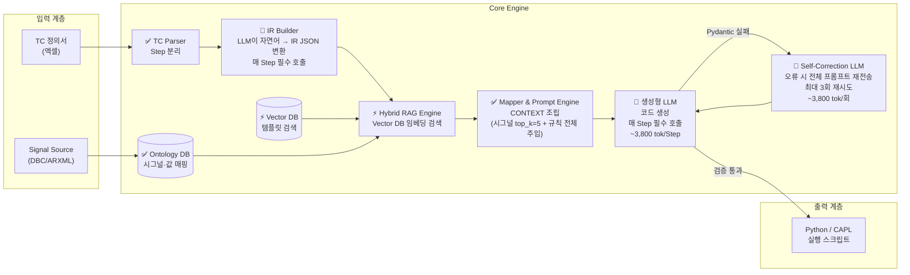

# 초기 시스템 설계 (Initial Design)

본 폴더는 TestScriptGenerator 프로젝트의 **초기 설계 단계** 문서를 담고 있습니다. IR(Intermediate Representation) 기반 파이프라인을 중심으로 시스템 전반의 구조, DB 스키마, 프롬프트, UI를 설계한 **1세대 설계안**입니다.

> ⚠️ 이 폴더의 설계는 현재 `docs/03_advanced_design`(Direct Synthesis) 및 `docs/04_contextual_rag_design`(Contextual RAG)으로 발전·대체되었습니다.

---

## 🏗️ 초기 아키텍처 흐름 (IR 기반 파이프라인)

> 🔴 **LLM 호출** (생성형, 고비용) | ⚡ **Embedding 모델** (저비용) | ✅ **결정론적 처리** (비용 0)



### LLM 호출 지점 요약

| 위치 | 호출 빈도 | 비용/호출 | 역할 |
| :--- | :---: | :---: | :--- |
| 🔴 IR Builder | **100%** Step | ~2,800 tok | 자연어 TC Step → IR JSON 변환 (환각 빈번) |
| 🔴 생성형 LLM (코드 생성) | **100%** Step | ~1,000 tok | IR + CONTEXT(시그널+규칙 전체) → 실행 코드 |
| 🔴 Self-Correction | ~15~20% Step | ~3,800 tok | Pydantic 검증 실패 시 전체 프롬프트 재전송 |
| ⚡ RAG Embedding | 100% Step | ~0.03 tok | Vector DB 유사도 검색 (저비용) |

> ❌ **핵심 문제**: Step 1개당 LLM이 **평균 1.2~1.4회** 호출되며, 매번 약 3,800 tok이 소비됩니다. TC 100건(600 Step) 기준 **약 2,310,000 tok**, 변환 성공률 ~65~70%에 그칩니다.


---

### 1. 전략 및 청사진 (Strategy & Blueprint)
시스템의 초기 목표(IR 기반 파이프라인) 및 전체 구조를 다루는 문서입니다.

| 문서 | 한줄 요약 |
| :--- | :--- |
| [detailed_design.md](./detailed_design.md) | **(최상위 설계)** TC Parser → IR Builder → RAG Engine → Mapper 파이프라인 상세 정의 및 어댑터 구조 설계 |
| [sequence_diagram.md](./sequence_diagram.md) | **(흐름)** 시스템 구성 요소 간의 런타임 상호작용 및 TC 파싱부터 코드 생성까지의 실행 흐름 |
| [implementation_plan.md](./implementation_plan.md) | **(계획)** 초기 개발 단계별 구현 계획 및 Phase 1~3 작업 항목 세부사항 |

### 2. 핵심 런타임 모듈 (Core Runtime Modules)
자연어 TC를 Intermediate Representation(IR)으로 변환하고 프롬프트를 생성하는 핵심 모직입니다.

| 문서 | 한줄 요약 |
| :--- | :--- |
| [ir_schema_spec.md](./ir_schema_spec.md) | **(규격)** Intermediate Representation(IR) JSON 객체 구조 및 스키마 명세 |
| [prompt_template_spec.md](./prompt_template_spec.md) | **(프롬프트)** LLM 전달용 시스템 프롬프트 템플릿, CONTEXT 주입 규칙 및 Few-Shot 예시 |

### 3. 파이프라인 및 예외 처리 (Process & Ops)
오류 발생 시의 자동 교정 및 스마트 대응 전략입니다.

| 문서 | 한줄 요약 |
| :--- | :--- |
| [strategy/Topic1_LLM_Self_Correction_Design.md](./strategy/Topic1_LLM_Self_Correction_Design.md) | **(예외)** 생성 코드 자동 검증 및 재시도를 위한 Self-Correction 루프 설계 |
| [strategy/Topic5_Smart_Adapter_LLM_Strategy.md](./strategy/Topic5_Smart_Adapter_LLM_Strategy.md) | **(전략)** 동의어 처리, 값 정규화 등 LLM을 활용한 스마트 어댑터 대응 전략 |

### 4. 구현 상세 (Implementation Details)
프로젝트 환경 설정 및 보조 시스템 설계 문서입니다.

| 문서 | 한줄 요약 |
| :--- | :--- |
| [dir_and_config_spec.md](./dir_and_config_spec.md) | **(설정)** 프로젝트 디렉터리 구조 및 `config.yaml` 설정 파일 명세 |
| [ui_proposal.md](./ui_proposal.md) | **(UI/UX)** Vector DB 시각화, 시그널 매핑 편집기 및 관리 화면 제안서 |
| [strategy/Topic2_Adapter_SDK_Design.md](./strategy/Topic2_Adapter_SDK_Design.md) | **(SDK)** SIMVA / CAPL 등 타겟 환경별 어댑터 인터페이스 설계 |
| [strategy/Topic3_Logging_Traceability_Design.md](./strategy/Topic3_Logging_Traceability_Design.md) | **(로깅)** 변환 이력 추적 및 디버깅을 위한 로깅 전략 |
| [strategy/Topic4_Testing_Architecture_Design.md](./strategy/Topic4_Testing_Architecture_Design.md) | **(테스트)** 시스템 품질 검증을 위한 유닛/통합 테스트 구조 설계 |

### 5. DB 설계 및 예시 데이터 (DB Design & Sample Data)
초기 시스템의 데이터 저장 구조 및 시나리오 데이터입니다.

| 문서 | 한줄 요약 |
| :--- | :--- |
| [db_design.md](./db_design.md) | **(스키마)** Vector DB와 Ontology DB의 초기 스키마 및 검색 쿼리 패턴 정의 |
| [rag_db_schema_sample.md](./rag_db_schema_sample.md) | **(샘플)** ACTION / LOOP / IF-ELSE 등 타입별 실제 Vector DB 예시 데이터 |
| [rag_mock_data_scenarios.md](./rag_mock_data_scenarios.md) | **(시나리오)** 자연어 입력부터 코드 생성까지 전 과정의 목(Mock) 예시 시나리오 |

---

## 🗺️ 설계 발전 경로

```
02_design (초기 설계)
    │  IR 기반, LLM이 모든 TC Step을 JSON으로 변환
    │  문제: 고비용, 환각 빈번, IR 객체 관리 복잡
    ▼
03_advanced_design (Direct Synthesis)
    │  IR 제거, 3-Tier Extractor + 템플릿 조립 방식
    │  성과: LLM 호출 94% 절감, 정확도 향상
    ▼
04_contextual_rag_design (Contextual RAG)
       Contextual Indexing + Fuzzy Filter + Error Compressor
       성과: 추가 49% 절감, 정확도 93~96%
```
