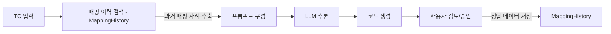

# [테스트 스크립트 자동화 DB 설계서]

## 1. DB 도입의 목적 (스터디 및 실무 관점)
본 프로젝트에서 DB를 도입함으로써 얻는 핵심 이점은 다음과 같습니다.
1.  **지속적 학습 (Feedback Loop)**: 사용자가 승인한 시그널 매핑 결과를 저장하여, 다음 변환 시 LLM이 더 정확하게 매핑하도록 가이드(Few-shot)를 제공합니다.
2.  **RAG 고도화**: 시그널의 의미적 유사성 검색을 위해 벡터 데이터를 저장하고 관리합니다.
3.  **이력 관리**: 변환 전후의 TC와 생성된 스크립트를 관리하여 버전 관리 및 재추출을 용이하게 합니다.

## 2. 추천 DB 스택
학습용이면서 파이썬 환경에서 가장 호환성이 좋은 조합을 추천합니다.

1.  **RDBMS: SQLite (필수)**
    -   **이유**: 별도 설치가 필요 없고 파일 하나로 관리됨. Python 내장 라이브러리(`sqlite3`) 또는 `SQLAlchemy`로 즉시 사용 가능.
    -   **용도**: 정형 데이터(TC 정보, 시그널 마스터, 사용자 매핑 이력) 저장.
2.  **Vector DB: FAISS 또는 ChromaDB (옵션, RAG용)**
    -   **이유**: LLM 기반 솔루션의 핵심인 '의미 기반 검색'을 구현하기 위함.
    -   **용도**: 시그널 명칭 및 설명을 임베딩 벡터로 저장하여 유사도 검색 수행.

## 3. 데이터베이스 스키마 설계 (ERD)

### 3.1. 테이블 정의 (SQLAlchemy 기반)

#### 1) `test_case` (TC 마스터)
- TC의 메타데이터와 원본 텍스트를 저장합니다.
- `id` (PK), `tc_name`, `original_content` (JSON/TSV), `created_at`

#### 2) `signal_master` (시그널 Registry)
- `signals.py` 및 `Signal.cfg`에서 추출한 모든 시그널 목록입니다.
- `id` (PK), `term`, `full_path` (e.g. signals.BDC.XXX), `data_type`, `description`

#### 3) `mapping_history` (매핑 학습 데이터 - 핵심!)
- 사용자가 검토하고 확정한 TC 변수명과 실제 시그널 간의 매핑 정보입니다.
- **LLM에게 "이전에는 이걸 이렇게 매핑했어"라고 알려줄 때 사용(RAG)**합니다.
- `id` (PK), `tc_var_name`, `signal_id` (FK), `confidence_score`, `user_confirmed` (Boolean)

#### 4) `generation_log` (추론 이력)
- 생성된 스크립트와 당시 사용된 프롬프트를 저장합니다.
- `id` (PK), `tc_id` (FK), `generated_code`, `prompt_used`, `created_at`

## 4. LLM과의 통합 아키텍처

## 5. 구현 가이드
- **언어/라이브러리**: `Python` + `SQLAlchemy` (ORM) 사용 추천.
- **벡터 검색**: `ChromaDB` 라이브러리를 사용하여 시그널 명칭의 벡터 인덱스 구축.

이 설계를 통해 단순한 변환기를 넘어, **데이터가 쌓일수록 똑똑해지는 자동화 솔루션**을 구현할 수 있습니다.
