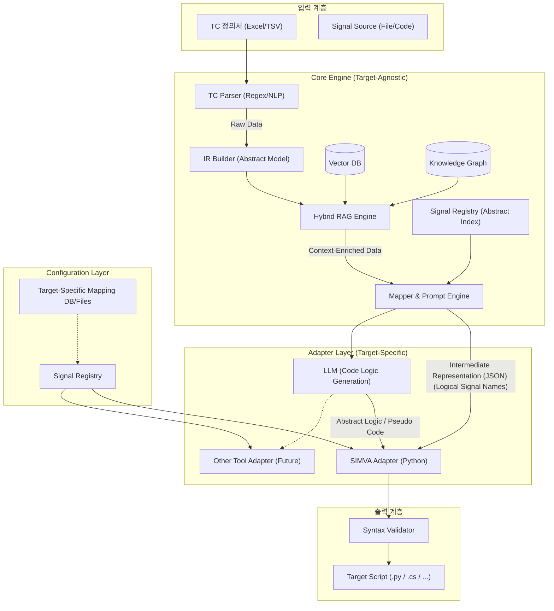

# [테스트 스크립트 자동화 솔루션 상세 설계서]

## 1. 시스템 아키텍처 설계 (Extensible Architecture)

### 1.1. 전체 구성도


## 2. 모듈별 상세 설계 및 구현 계획

### 2.1. Signal Loader & Target-Specific Code Registry
- **목적**: 논리적 시그널(Logical Signal)을 타겟 프레임워크별 실제 변수명/코드명으로 동적 변환.
- **설계 (Dictionary/DB Mapping)**:
    - 하나의 논리적 TC를 여러 언어로 변환하기 위해, Core Engine이 시그널 코드를 직접 주입하지 않습니다.
    - 각 어댑터(Adapter)는 실행될 때 타겟(SIMVA, CAPL)에 맞는 매핑 정보를 별도로 로드하여 사용합니다.
- **구현 상세 (Implementation Details)**:
    - **라이브러리**: `ast` (Python 표준 라이브러리)
    - **핵심 로직 (AST Parsing)**:
      ```python
      import ast

      def parse_signals(file_path):
          with open(file_path, "r", encoding="utf-8") as f:
              tree = ast.parse(f.read())
          
          registry = {}
          # ClassDef(Profile) -> Assign(Signal) 탐색
          for node in ast.walk(tree):
              if isinstance(node, ast.ClassDef):
                  profile_name = node.name
                  for submapping in node.body:
                      if isinstance(submapping, ast.Assign):
                          # signals.BDC.SignalName 구조 추출
                          signal_name = submapping.targets[0].id
                          full_path = f"signals.{profile_name}.{signal_name}"
                          registry[signal_name] = full_path
          return registry
      ```
    - **설계 의도**: `import`하여 실행하는 것보다 `ast`로 파싱하는 것이 안전하며(Side-effect 없음), 정적 분석의 핵심 기초 기술입니다.

### 2.2. TC Parser & IR Builder (중간 표현 생성)
- **설계 의도**: 자연어 TC를 특정 언어에 종속되지 않는 **중립적 구조체(Intermediate Representation)**로 변환.
- **IR 데이터 구조 (JSON Schema)**:
  ```json
  [
    {
      "step_id": 1,
      "type": "ACTION", // or "CHECK", "CONTROL"
      "keyword": "HeadLamp",
      "value": "ON",
      "condition": {
        "operator": "==", 
        "target": "ON"
      },
      "meta": {
        "original_text": "1. (HeadLamp = On)"
      }
    }
  ]
  ```
- **구현 상세**:
    - **Parsing**: 정규식으로 텍스트 추출.
    - **Normalization**: "Wait(500)" -> `{"type": "WAIT", "value": 0.5, "unit": "sec"}` 로 표준화.
    - **Builder**: 파싱된 데이터를 위 JSON 스키마에 맞춰 객체화(`pydantic` 모델 활용 권장).
    - **Fault Tolerance**: 파싱에 실패한 문장은 즉시 예외를 발생시키지 않고 `{"type": "UNKNOWN", "meta": {"original_text": "..."}}` 로 캡슐화합니다.

### 2.3. Mapper & Prompt Engine (Hybrid RAG Architecture)
- **설계 의도**: IR과 매핑된 시그널 정보를 바탕으로, **선택된 타겟 언어(Target Language)**에 최적화된 프롬프트를 생성하며, 이 과정에서 **Vector DB**와 **Ontology**를 활용하여 도메인 지식을 주입합니다.
- **Advanced Knowledge Management**:
    - **Vector DB 연동**: 
        - 목적: 사용자의 비정형 자연어("엑셀 페달 밟기")와 정형화된 시그널 명칭(`VehicleSpeed` 등) 간의 의미론적(Semantic) 매핑을 수행.
        - 매커니즘: TC 파싱 중 모호한 키워드 발견 시, Vector DB에 임베딩 질의를 통해 가장 유사도 점수가 높은 논리적 시그널 후보군을 검색합니다.
    - **Ontology (Knowledge Graph) 연동**:
        - 목적: 차량 제어 로직의 인과관계 및 선행 조건 검증 (상식 추론 기능).
        - 매커니즘: "주행 테스트" 스텝 생성 전, Ontology를 쿼리하여 "엔진 상태 == ON" 조건이 만족되었는지(이전 단계에서 수행되었는지) 확인. 누락 시 LLM 프롬프트에 경고 정보를 함께 주입하여 자동 보완 코드(또는 실패 주석)를 생성토록 합니다.
- **Dynamic Prompting Strategy**:
    - **Enriched Context**: RAG 엔진(Vector DB + Ontology)에서 검색된 도메인 규칙 및 시그널 매핑 후보를 Context에 주입.
        ```text
        [Domain Context (from RAG)]
        - Ambiguous term "accelerate" best matches logical signal "VehicleSpeed" (Similarity: 0.92)
        - Pre-condition Rule: To modify "VehicleSpeed", "Ignition_Status" must be ON.
        ```
    - **Target-Specific Rule Injection**: 어댑터로부터 해당 언어의 문법 규칙을 받아 프롬프트에 추가.
        ```text
        [Generation Rules for SIMVA]
        1. Use 'simva.set_signal(KEY, VAL)' for actions.
        2. Use 'simva.keep_eq(KEY, VAL, TIME)' for checks.
        ```
- **구현 상세**:
    - `HybridRAGEngine` 클래스가 Vector DB(예: ChromaDB/Milvus) 및 Ontology Database(예: Neo4j 또는 JSON-LD 파일)와 통신.
    - `PromptBuilder` 클래스가 RAG 검색 결과와 타겟 언어 규칙을 결합하여 최종 LLM 프롬프트를 완성.

### 2.4. LLM Provider Abstraction (Local/Cloud 유연성 확보)
- **설계 의도**: 사용자의 하드웨어 환경(CPU vs GPU) 및 보안 요구사항에 따라, 코드 수정을 최소화하고 **설정(Configuration)만으로 LLM 엔진을 교체**할 수 있어야 합니다. 
  - **테스트/PoC 환경(Offline)**: 보안이 중요한 로컬 환경에서는 **CPU 기반의 Local LLM**(예: Ollama, Llama.cpp) 지원.
  - **운영/고성능 환경(Online)**: 더 높은 추론 능력이 필요할 때는 **Cloud API**(예: OpenAI, Google Gemini, Anthropic Claude) 지원.
- **아키텍처 (Strategy Pattern)**:
    - **Interface (`ILLMProvider`)**:
      ```python
      class ILLMProvider(ABC):
          @abstractmethod
          def generate(self, prompt: str, system_prompt: str) -> str: pass
      ```
    - **Implementation 1 (`LocalCPUProvider`)**:
      - `Ollama` API 또는 `llama-cpp-python` 구동.
      - 특징: 모델 로드에 시간이 걸릴 수 있으므로 초기화(Init) 최적화 필요. CPU 환경에 맞춰 쓰레드(Threads) 수량 제어.
    - **Implementation 2 (`OpenAIProvider`)**:
      - `openai` 공식 Python SDK 활용 (GPT-4o, GPT-4-turbo 등).
    - **Implementation 3 (`GeminiProvider`)**:
      - `google-generativeai` SDK 활용 (Gemini 1.5 Pro, Flash 등).
    - **Configuration 팩토리 패턴**:
      - `config.yaml` 파일에서 `llm: type: "gemini"` 와 같이 설정해주면, 팩토리 클래스가 해당하는 Provider 인스턴스를 Core Engine에 주입(Dependency Injection)합니다. 코어 로직은 전혀 바뀌지 않습니다.

### 2.5. Multi-Target Adapter & Generator (핵심 확장 포인트)
- **설계 의도**: 특정 언어(Python/SIMVA)에 종속된 로직을 **어댑터(Adapter)**로 격리하여 확장성 확보.
- **아키텍처 (Strategy Pattern)**:
    - **Interface (`ICodeGenerator`)**:
      ```python
      class ICodeGenerator(ABC):
          @abstractmethod
          def generate_setup(self, ir_data): pass
          @abstractmethod
          def generate_action(self, step_ir): pass
          @abstractmethod
          def validate(self, code): pass
      ```
    - **Implementation 1 (`SimvaGenerator`)**:
      - `generate_action` -> `simva.set_signal(...)` 생성
      - `validate` -> `ast.parse` 사용
    - **Implementation 2 (`CaplGenerator` - Future)**:
      - `generate_action` -> `setSignal(...)` 생성 (CAPL 문법)
      - `validate` -> Regex 또는 CAPL 컴파일러 연동
    - **Flexible Strategy (Adapter-side LLM Integration)**:
        - `SimvaGenerator`와 같이 문법이 명확한 타겟은 "Direct Translation (하드코딩)" 방식을 채택하여 빠른 속도와 100% 문법 안정성을 보장합니다.
        - 반면, 1:1 방식의 하드코딩 매핑이 불가능할 정도로 복잡한 비표준 레거시 언어나, 자연어 스크립트(영문 BDD 등)로 번역해야 하는 특수한 타겟의 경우, 해당 어댑터 내부에서 자체적으로 LLM API 호출하여 **LLM 기반의 타겟 코드 생성(Code Generation)** 로직을 구현할 수 있습니다.
        - 핵심 원칙은 **"Core Engine은 중립적인 JSON(IR)만 책임진다"**는 것이며, 이를 받아 하드코딩 연산으로 치환할지 LLM 프롬프트로 치환할지는 전적으로 각 어댑터의 자율에 맡기는 **완벽한 디커플링(Decoupling)** 구조입니다.
    - **Error Handling (UNKNOWN IR)**:
        - `generate_action` 내에서 `type == UNKNOWN` 인 경우 `raise` 하지 않고 언어별 주석 형태로 출력.
        - Python 예시: `# FIXME: Conversion Failed - "알 수 없는 문장"`
        - CAPL 예시: `/* FIXME: Conversion Failed - "알 수 없는 문장" */`

- **Process Isolation Architecture (Stability & Polyglot)**:
    - **설계 의도**: 외부 플러그인을 독립 프로세스로 실행하여, 메인 애플리케이션의 메모리와 실행 흐름을 완벽하게 보호하고 실시간 진행 상태를 모니터링합니다.
    - **통신 프로토콜 (StdIO)**:
        - `stdin`: JSON 포맷의 통짜 IR 데이터 전달.
        - `stdout`: 오직 완성된 코드 텍스트만 출력.
        - `stderr`: 실시간 로그, 진행률(`[PROGRESS] 10/100`), 에러(`[ERROR] ...`) 출력.
    - **구현 상세 (`subprocess` 및 Thread 활용)**:
      ```python
      import subprocess
      import json
      import threading

      class AdapterRunner:
          def __init__(self, script_path, update_callback=None):
              self.script_path = script_path
              self.update_callback = update_callback  # UI 업데이트 콜백

          def run(self, ir_data: dict) -> str:
              process = subprocess.Popen(
                  ["python", self.script_path], 
                  stdin=subprocess.PIPE, 
                  stdout=subprocess.PIPE, 
                  stderr=subprocess.PIPE,
                  text=True
              )
              
              # 별도 스레드에서 stderr 실시간 로깅 모니터링
              def monitor_stderr(pipe):
                  for line in iter(pipe.readline, ''):
                      line = line.strip()
                      if not line: continue
                      if self.update_callback:
                          self.update_callback(line)
                      
              t = threading.Thread(target=monitor_stderr, args=(process.stderr,))
              t.start()
              
              # IR 전달 (Stdin) 및 stdout(생성된 코드) 대기
              stdout, _ = process.communicate(input=json.dumps(ir_data))
              t.join()
              
              if process.returncode != 0:
                  raise RuntimeError("Plugin execution failed. See logs for details.")
                  
              return stdout
      ```
    - **플러그인 작성 표준**:
      - `stdout`에는 `print()` 등으로 일반 로그를 출력하면 안 됩니다. 오직 코드 문자열 전용입니다.
      - 로그 및 진행률 전송은 무조건 `sys.stderr.write()` 로 출력해야 합니다.


- **Code Validator (Safety Layer)**:
    - 각 구현체(`SimvaGenerator`) 내부에서 해당 언어에 맞는 검증 로직(`validate`)을 수행.

### 2.6. Macro System (User-Defined Functions)
- **설계 의도**: `simva` 라이브러리에 없는 복잡한 시퀀스(예: 시동, 복합 제어)를 재사용 가능한 함수로 모듈화하고, 타겟 언어별로 독립적으로 관리합니다.
- **구현 상세 (Adapter-Side Resolution)**:
    - **IR 포맷**: Core Engine은 특정 텍스트를 함수 호출로 인지하면 `{"type": "MACRO_CALL", "name": "Initial_EngineON"}`이라는 논리적 IR을 생성합니다.
    - **매크로 탐색 (AST Parsing in Adapter)**:
        - `SIMVA Adapter`는 실행될 때 타겟 디렉토리의 `macros.py` 파일을 `ast` 모듈로 파싱(`ast.parse`)하여 함수(`ast.FunctionDef`) 목록을 추출하고 `Macro Registry`를 구축합니다.
        - `import` 하지 않고 `ast`를 쓰는 이유는, 어댑터가 실행되는 환경에서 `simva`나 `signals.py` 패키지가 없을 수도 있기 때문에 안전하게 정적 분석만 수행하기 위함입니다.
    - **코드 생성 (Code Generation)**:
        - 어댑터는 IR에서 `MACRO_CALL`을 전달받으면, 자신의 `Macro Registry`에 해당 함수가 존재하는지 확인합니다.
        - 존재할 경우 타겟 문법에 맞는 코드를 생성합니다.
      ```python
      # [Generated Script Example]
      from macros import Initial_EngineON  # Adapter가 자동으로 Header에 추가
      
      def test_case_1():
          Initial_EngineON()  # 생성된 Macro Call
      ```

## 3. 데이터 흐름 및 통합 전략
- **통합 포인트**: 모든 모듈은 인터페이스 기반으로 설계되어, 향후 특정 모델(GPT-4 -> Claude 3.5 등)을 교체하더라도 전체 워크플로우 영향 최소화.
- **UI/DB 연동**: 
    - **GUI**: Streamlit을 통해 사용자에게 변환 과정을 시각적으로 전달 (상세: `ui_proposal.md`).
    - **DB**: 매핑 결과와 학습 데이터를 영구 저장하여 지속적 고도화 지원 (상세: `db_design.md`).
