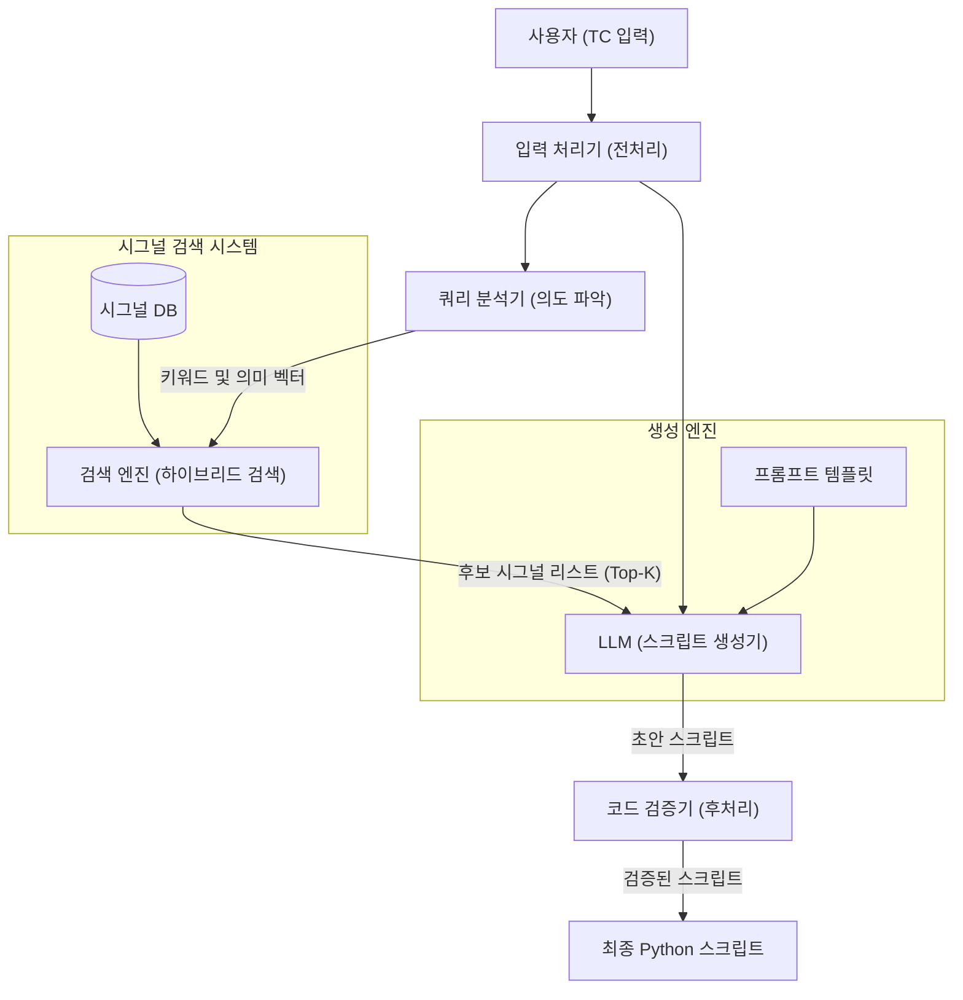

# [SIMVA 테스트 자동화 솔루션 상세 설계서]

## 1. 개요
본 문서는 자연어 테스트 케이스(TC)를 입력받아 SIMVA 자동화 스크립트(Python)를 생성하는 솔루션의 상세 설계 초안입니다. **설계 Agent**로서 전체 시스템 구성과 핵심인 **시그널 DB 연동 메커니즘**을 정의합니다.

## 2. 전체 시스템 구성도



## 3. 시그널 DB 연동 및 검색 전략

가장 중요한 '정확한 시그널명 참조'를 위해 **하이브리드 RAG (검색 증강 생성)** 방식을 채택합니다.

### 3.1. 시그널 DB 구조 정의 (Updated)
사용자가 제공한 `Signal.cfg` (CSV 포맷)를 마스터 데이터로 사용합니다.

- **원본 데이터 소스**: `Signal.cfg`
- **파일 포맷**: CSV (Comma Separated Values)
- **주요 컬럼**:
    - `term`: 시그널 명칭 (예: `NM_State_BDC_FD_BCAN1`) -> **검색 및 코드 생성의 핵심 Key**
    - `datatype`: 데이터 타입 (예: `uint16`) -> 값 검증에 활용
    - `default`: 기본값
- **전처리 로직**:
    - `Signal.cfg`를 로드하여 메모리 상에 `DataFrame` 또는 `List[Dict]` 형태로 캐싱합니다.
    - `term` 컬럼을 토큰화(Tokenization)하여 검색 인덱스를 생성합니다. (예: `NM_State_BDC` -> `NM`, `State`, `BDC`)

### 3.2. LLM 참조 메커니즘 (검색 프로세스)

1.  **Step 1: 쿼리 추출**
    - TC의 '신호/변수' 및 '시험 방법' 텍스트에서 키워드 추출.
    - 예: "Lamp_PuddleLamp = On" -> **Query**: `Lamp`, `Puddle`, `Lamp`

2.  **Step 2: 하이브리드 검색 (Signal.cfg 대상)**
    - **Fuzzy Search**: `term` 컬럼을 대상으로 문자열 유사도 검색 (Levenshtein Distance 등).
        - 이유: TC의 변수명(`Lamp_PuddleLamp`)과 실제 시그널(`PuddleLamp_Status_BDC` 등)이 정확히 일치하지 않을 수 있음.
    - **Keyword Matching**: 포함된 단어 기반 필터링.

3.  **Step 3: 프롬프트 주입**
    - 검색된 `term`과 `datatype` 정보를 제공하여 정확한 코드를 작성하도록 유도.
    - **프롬프트 예시**:
        ```text
        [지시사항]
        TC의 'Lamp_PuddleLamp'에 해당하는 시그널을 아래 후보에서 찾아 매핑하시오.
        
        [시그널 후보 (from Signal.cfg)]
        1. Term: BDC_PuddleLamp_Control (Type: uint8)
        2. Term: NM_State_BDC_FD_BCAN1 (Type: uint16)
        
        [출력]
        simva.set_signal(signals.BDC.BDC_PuddleLamp_Control, 1)
        ```

### 3.3. 검증 전략
- 생성된 코드에 포함된 시그널 명이 시그널 DB에 실제로 존재하는지 `정확한 매칭(Exact Match)`으로 검증합니다.
- 존재하지 않는 시그널(환각)이 발견되면, 유사도가 가장 높은 시그널로 자동 교정하거나 에러를 리포트합니다.


### 3.4. [상세 분석] Excel 컬럼 vs SIMVA 함수 매핑 정의

사용자가 제공한 TC의 로직을 SIMVA 스크립트로 정확히 변환하기 위한 **상세 매핑 테이블**입니다.

#### 1) 공통 파싱 규칙 (Parsing Rules)
모든 셀 데이터는 `Step` 단위로 줄바꿈 또는 번호(`1.`, `2.`)로 구분되어 있습니다. 각 Step은 정규식 `\(([^)]+)\)`을 통해 **Action(함수/변수)**과 **Value(값)**를 추출합니다.

- **변수명 매핑**: TC에 적힌 변수명(예: `VehicleSpeed`)은 `Signal.cfg`의 `term` 컬럼을 검색(Fuzzy Match)하여 `signals.[Profile].[Term]` 형태로 변환됩니다.
- **값(Value) 변환**:
    - `On/Off` -> `1/0`
    - `0x5` -> `5` (십진수 변환)
    - `500` (Wait 인자) -> `0.5` (ms -> sec 변환, 만약 SIMVA가 sec 단위라면)

#### 2) 컬럼별 상세 매핑 (Column Mapping)

| Excel 컬럼명 | TC 예시 데이터 | 파싱된 의미 | 매핑될 SIMVA 함수 / 로직 |
| :--- | :--- | :--- | :--- |
| **시험 전 조건**<br>(Pre-condition) | `1. (Initial_EngineON)` | 엔진 시동 초기화 | `simva.run_macro("Initial_EngineON")`<br>*(사용자 정의 매크로 또는 시퀀스)* |
| | `2. (StartLogging(CAN))` | 로깅 시작 | `simva.start_logging("CAN")`<br>*(Trace/Acquisition 시작)* |
| | `VehicleSpeed = 0` | 초기 속도 0 설정 | `simva.set_signal(signals...VehicleSpeed, 0)` |
| **시험 방법**<br>(Test Procedure) | `1. (VehicleSpeed = 0x5)` | 속도 5로 설정 | `simva.set_signal(signals...VehicleSpeed, 5)` |
| | `2. (Wait(500))` | 500ms 대기 | `simva.wait(0.5)`<br>*(단위 확인 후 변환 적용)* |
| | `SSB(SSB1_On)` | 버튼 입력 | `simva.set_signal(signals...SSB1, 1)` |
| **판정 조건**<br>(Expected Result) | `1. (Lamp_PuddleLamp = On)` | 램프 켜짐 확인 | `simva.is_eq(signals...PuddleLamp, 1)` |
| | `(CheckLessKPH(5))` | 5km/h 미만 확인 | `simva.is_lt(signals...VehicleSpeed, 5)` |
| | `(CheckOverKPH(10))` | 10km/h 초과 확인 | `simva.is_gt(signals...VehicleSpeed, 10)` |
| | `A and B` | 복합 조건 | `simva.is_eq(...)` **AND** `simva.is_eq(...)`<br>*(Python의 `assert` 또는 연속 호출)* |
| **초기화**<br>(Clean up) | `Reset = OFF` | 리셋 해제 | `simva.set_signal(signals...Reset, 0)` |
| | `CheckDTCOFF` | DTC 확인 | `simva.check_dtc(False)` (매크로 추정) |

### 3.5. 코드 생성 프롬프트 전략 (Prompt Engineering)

위 매핑 테이블을 LLM의 **System Prompt**에 포함시켜, LLM이 '번역기'처럼 정확하게 동작하도록 합니다.

**[System Prompt 구성안]**
1.  **Role**: "당신은 SIMVA 전문 스크립트 변환기입니다."
2.  **Signal Dictionary**: 검색된 Top-K 시그널 리스트 (`Term`, `Type`) 제공.
3.  **Mapping Rules**:
    - "Set A = B" 패턴은 `simva.set_signal(A, B)`로 변환하라.
    - "Wait(T)" 패턴은 `simva.wait(T/1000)`로 변환하라.
    - "Check(A = B)" 패턴은 `simva.is_eq(A, B)`로 변환하라.
4.  **Constraint**: 없는 함수를 만들어내지 마시오. 제공된 `simva` API만 사용하시오.

## 4. 모듈별 구현 계획 (Phase 2)

### [설계 Agent] (완료)
- 상세 설계서 작성 및 매핑 로직 확정.

### [구현 Agent] (대기 중)
1.  **Signal Loader 구현**: `Signal.cfg` 파싱 및 검색 인덱스 생성 (`pandas` 사용).
2.  **TC Parser 구현**: Excel(TSV)의 정규식 기반 구문 분석기 개발.
3.  **Generator 구현**: 파싱된 'Action Item'을 프롬프트에 태워 Python 코드로 변환하는 로직.

### [검증 Agent] (대기 중)
- 변환된 스크립트의 문법 및 시그널 경로 유효성 검사.

## 5. 승인 요청 사항
사용자께서 요청하신 **"Excel 컬럼 -> Python 함수 매핑"**을 상세히 정의하였습니다.
이 설계안대로 **Signal.cfg**를 참조하여 변환 로직을 구현해도 되겠습니까?
승인해 주시면 즉시 구현 Agent가 작업을 시작하겠습니다.
