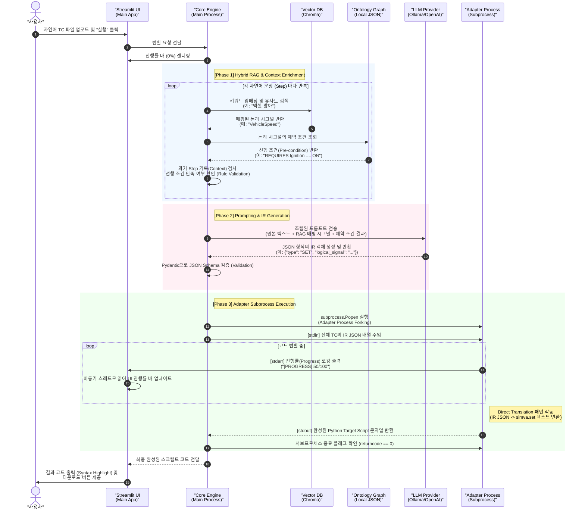

# 시스템 전체 실행 흐름도 (Sequence Diagram)

본 문서는 사용자가 자연어 테스트 케이스(TC)를 입력한 시점부터 최종적으로 타겟 스크립트(simva.py)가 생성되기까지의 **전체 데이터 교환 흐름**을 시간 순서에 따라 시각화한 시퀀스 다이어그램입니다.

이 다이어그램은 이전에 설계된 Vector DB, Ontology, Core Engine(LLM), Adapter 프로세스가 언제 어떻게 맞물려 돌아가는지 단일 뷰로 제공합니다.

---

## 1. 전체 실행 흐름 시퀀스 다이어그램 (Mermaid)

---

## 2. 각 구간별 핵심 설계 요약

### Phase 1: Hybrid RAG & Context Enrichment
단순 정규표현식이 아닌 Vector DB와 온톨로지를 결합하여 **지식을 증강**하는 구간입니다.
이 과정에서 사용자의 모호한 텍스트("엑셀")를 벡터 검색으로 표준 `Logical Signal`로 치환하고, 온톨로지에서 찾아낸 "시동 연관성" 규칙을 가져옵니다. **실제 코드가 아직 등장하지 않는 순수 논리적 공간**입니다.

### Phase 2: Prompting & IR Generation
취합된 RAG 컨텍스트를 LLM에게 프롬프트로 제공합니다.
LLM은 제약 조건 위반을 스스로 판단하고, 결과적으로 `Pydantic`으로 정의된 **순수 JSON 형태의 IR(Intermediate Representation)**만 내뱉습니다. LLM의 환각(Hallucination)에 의한 문법 에러 위험을 없애줍니다.

### Phase 3: Adapter Subprocess Execution
가장 핵심인 **"Direct Translation" 패턴** 구간입니다.
아예 메인 파이썬 실행 환경을 쪼개어(`subprocess`) 독립된 어댑터 스크립트를 띄웁니다.
이 어댑터는 `stdin`으로 넘겨받은 안전한 JSON 덩어리를 `simva.set(...)` 같은 하드코딩 포맷 규칙에 맞춰 "직접" 문자열로 변환하여 `stdout`으로 최종 뱉어냅니다. 그동안 `stderr` 채널을 이용해 메인 UI를 업데이트합니다.
