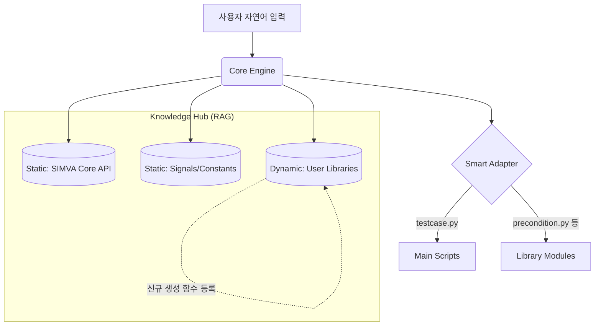

# 주제 5: 지능형 지식 기반 어댑터 및 동적 라이브러리 오케스트레이션 설계

본 문서는 SIMVA 스크립트의 복잡한 구조(다중 모듈, 동적 함수 생성)를 효율적으로 처리하기 위한 **스마트 어댑터(Smart Adapter)**의 통합 설계안을 정리합니다.

---

## 1. 개요 (Overview)

SIMVA 테스트 스크립트는 단순한 명령의 나열이 아니라, `precondition`, `method`, `check` 등 **사용자 정의 라이브러리를 동적으로 생성하고 참조하는 프로젝트 수준의 구조**를 가집니다. 이를 구현하기 위해 어댑터는 단순한 '번역기'를 넘어, **'지식 기반의 프로젝트 빌더'** 역할을 수행해야 합니다.

---

## 2. 핵심 아키텍처: 투 패스(Two-Pass) 파이프라인

변환 과정을 두 단계로 나누어, 전체 맥락 파악과 세부 코드 생성을 분리합니다.

### Phase 1: 글로벌 맥락 분석 (Core Engine)
1.  **매크로 식별**: 여러 테스트 케이스를 분석하여 반복되는 로직을 발견하고 `MacroDefinitionIR`으로 추상화합니다.
2.  **지식 검색(RAG)**: 매크로 설계 시 Vector DB에서 유사한 기존 라이브러리가 있는지 확인합니다.
3.  **구조 설계**: 메인 스크립트 흐름과 외부 제공 라이브러리 간의 의존성 관계를 정의합니다.

### Phase 2: 지능형 프로젝트 빌드 (Smart Adapter)
1.  **라이브러리 오케스트레이션**: `precondition.py`, `method.py` 등 물리적 파일이 없으면 생성하고, 있으면 신규 함수를 추가(Append)합니다.
2.  **국지적 로직 구현**: `COMPLEX_LOGIC` IR을 만나면, 어댑터 내장 LLM이 특정 상황에 최적화된 파이썬 제어문(if, for)을 생성합니다.
3.  **의존성 주입**: 메인 TC 파일 상단에 필요한 모듈들을 자동으로 `import` 합니다.

---

## 3. 지식 허브 및 피드백 루프 (Knowledge Hub)

어댑터는 세 가지 레이어의 지식을 결합하여 Hallucination을 방지하고 정확도를 극대화합니다.

### A. 정적 지식 (Static Knowledge)
*   **SIMVA Core API**: `simva.wait`, `is_eq`, `keep_ge` 등 공식 매뉴얼의 모든 함수 문법.
*   **시그널 & 상수**: `signals.BDC.*`, `q.EUROPE` 등 실제 타겟 환경의 변수 매핑 테이블.

### B. 동적 지식 피드백 루프 (Knowledge Feedback Loop)
*   **생성 및 학습**: LLM이 변환 중 생성한 `precondition.Prepare_Vehicle()`과 같은 함수 정보를 **즉시 Vector DB에 업데이트**합니다.
*   **지식 재사용**: 다음 변환 시 동일한 개념이 등장하면 새로 만들지 않고, DB에서 검색된 기존 함수를 호출하도록 설계합니다.

---

## 4. 복잡 로직 처리 전략 (Complex Logic Handling)

단순한 `SET/WAIT` 외의 복잡한 조건문 처리를 위해 **`ComplexLogicIR`**을 도입합니다.

*   **IR 구조**: `{ "type": "COMPLEX_LOGIC", "instruction": "국가별 사양에 따른 부저 횟수 검증" }`
*   **어댑터 LLM 개입**: 어댑터는 해당 지시어를 받으면, 현재 사용 가능한 시그널/상수 DB 정보를 프롬프트에 동봉하여 어댑터 레벨에서 **순수 파이썬 코드 블록**을 생성합니다.
*   **장점**: Core Engine은 플랫폼 중립적인 '의도'만 전달하고, 실제 파이썬 문법 처리는 전문 어댑터가 담당하여 코드 품질을 높입니다.

---

## 5. 실행 로드맵 (Roadmap)

1.  **[1단계] IR 고도화**: `models.py`에 `ConditionIR`, `MacroDefinitionIR` 반영. (모델 확장)
2.  **[2단계] 다중 파일 제어 구현**: `BaseAdapter`에 파일 시스템 쓰기 및 함수 Append 로직 추가.
3.  **[3단계] 지식 연동**: RAG 엔진과 어댑터 간의 실시간 지식 등록/검색 API 연동.
4.  **[4단계] 프롬프트 튜닝**: 복잡 로직 생성을 위한 어댑터 전용 시스템 프롬프트 설계.

---

> [!IMPORTANT]
> 이 설계의 핵심은 **"변환 환경 자체가 시간이 지날수록 더 많은 지식을 축적하여 자동화율이 높아지는 자가 증식형 시스템"**을 구축하는 데 있습니다.
