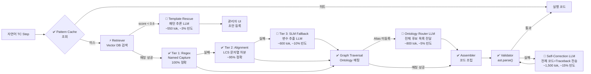

# Direct Synthesis 아키텍처

본 폴더는 `docs/02_design`의 초기 설계를 대체하는 **2세대 고도화 설계** 문서를 담고 있습니다. 핵심 철학은 **"IR 없이, LLM 없이, 데이터에서 직접 코드를 합성한다"(Direct Synthesis from Data)**입니다.

> 이 폴더의 설계는 현행 구현의 기반이며, `docs/04_contextual_rag_design`(Contextual RAG)에서 더욱 정밀하게 보강됩니다.

---

## 📂 문서 목록

### 1. 전략 및 청사진 (Strategy & Blueprint)
시스템의 목표("No IR, No LLM") 및 전체 구조를 다루는 최상위 문서입니다.

| 문서 | 한줄 요약 |
| :--- | :--- |
| [architecture_design.md](./architecture_design.md) | **(최상위 전략)** Vector DB 기반 Direct Synthesis 파이프라인(Retriever → Extractor → Assembler → Validator) 정의 및 설계 원칙 |
| [tc_script_generation_strategy.md](./tc_script_generation_strategy.md) | **(전략)** TC 4대 컴포넌트별 생성 전략 및 3단계 값 정규화 파이프라인(Spec Match → Alias → LLM) 설계 |

### 2. 핵심 런타임 모듈 (Core Runtime Modules)
모듈별 인터페이스 및 핵심 인터랙션 로직입니다.

| 문서 | 한줄 요약 |
| :--- | :--- |
| [implementation_spec.md](./implementation_spec.md) | **(인터페이스)** `TemplateRetriever`, `TierExtractor`, `OntologyAssembler` 등 핵심 모듈의 Python 클래스 및 함수 구현 명세 |

### 3. 파이프라인 및 예외 처리 (Process & Ops)
성능 목표 및 예외 상황(Fallback)에 대한 설계입니다.

| 문서 | 한줄 요약 |
| :--- | :--- |
| [advanced_performance_and_fallback.md](./advanced_performance_and_fallback.md) | **(성능/예외)** Tier 1→2→3 단계별 실패 처리, Template Rescue 및 Approval Queue 동작 설계 |

### 4. 구현 상세 (Implementation Details)
실제 개발 및 프롬프트 튜닝 시 참고할 기술 명세입니다.

| 문서 | 한줄 요약 |
| :--- | :--- |
| [execution_sequence.md](./execution_sequence.md) | **(흐름)** 방안 B의 런타임 실행 시퀀스 (Cache → Retriever → 3-Tier Extractor → Assembler → Validator) |
| [prompt_engineering_guide.md](./prompt_engineering_guide.md) | **(프롬프트)** Extractor Tier 3, Ontology Router, Self-Correction, Rescue 지점의 공식 프롬프트 템플릿 |
| [ui_proposal.md](./ui_proposal.md) | **(UI/UX)** No-Code Template Builder UI, Ontology 편집기 및 모니터링 화면 와이어프레임 |

### 5. DB 설계 및 예시 데이터 (DB Design & Sample Data)
시스템의 기반이 되는 데이터 스키마 및 샘플 데이터입니다.

| 파일 | 한줄 요약 |
| :--- | :--- |
| [db/vector_db_schema.md](./db/vector_db_schema.md) | Vector DB 레코드 스키마(`id`, `regex_pattern`, `target_code` 등) 및 검색 쿼리 예시 |
| [db/ontology_db_schema.md](./db/ontology_db_schema.md) | Ontology 지식 그래프 스키마, 동의어(Alias) 매핑 및 선행 조건 연결 설계 |
| [db/sample_simva_collection.json](./db/sample_simva_collection.json) | SIMVA 환경 Vector DB 샘플 레코드 예시 (JSON) |
| [db/sample_ontology_graph.json](./db/sample_ontology_graph.json) | Ontology DB 샘플 그래프 데이터 예시 (JSON) |

---

## 🏗️ 아키텍처 핵심 흐름

> 🔴 **LLM 호출** (생성형, 고비용) | ⚡ **Embedding 모델** (저비용) | ✅ **결정론적 처리** (비용 0)

### LLM 호출 지점 요약

| 위치 | 호출 빈도 | 비용/호출 | 역할 |
| :--- | :---: | :---: | :--- |
| 🔴 Tier 3 SLM Fallback | ~10% Step | ~600 tok | Regex·Alignment 실패 시 변수 추출 |
| 🔴 Ontology Router | ~5% Step | ~800 tok | Alias 미등록 시 전체 후보 목록 전달해 매핑 |
| 🔴 Self-Correction | ~15% Step | ~1,500 tok | ast.parse() 실패 시 전체 코드+Traceback 재전송 |
| 🔴 Template Rescue | ~3% Step | ~550 tok | score < 0.6 미등록 패턴 추론 |
| ⚡ Retriever Embedding | 100% Step | ~0.03 tok | Vector DB 검색 (저비용, 항상 실행) |

> ✅ **핵심 성과**: Step 1개당 LLM 호출 확률 **~20%**, 평균 약 170 tok. TC 100건 기준 **132,000 tok (방안 A 대비 94.3% 절감)**, 변환 성공률 ~88~91%.
> 방안 B → C 추가 보강 사항은 `docs/04_contextual_rag_design` 참조.

## 📊 방안 B 핵심 성과 (방안 A 대비)

| 지표 | 방안 A (현재) | 방안 B (본 폴더) |
| :--- | :---: | :---: |
| LLM 호출률 | 100%/Step | ~20%/Step |
| 토큰 비용 (100 TC) | 2,310K tok | 132K tok (**94.3% 절감**) |
| Step 변환 성공률 | ~65~70% | ~88~91% |

> 방안 B에서 C로의 추가 보강 → `docs/04_contextual_rag_design` 참조
