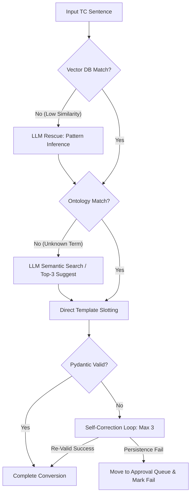

# Batch Processing 성능 최적화 및 예외 대응(Fallback) 체계

본 문서는 수천 개의 테스트 케이스(TC)를 안정적이고 빠르게 처리하기 위한 **지능형 배치 파이프라인**과, "모르는 것이 나왔을 때 어떻게 대처하는가"를 정의하는 **4단계 예외 대응 레이어(Layer)**를 통합하여 기술합니다.

---

## Part 1. Batch Processing & Performance 최적화 전략

### 1.1 LLM 호출 최적화 (Efficiency)

LLM은 지능형 엔진에서 가장 강력하지만 동시에 가장 느리고 비싼 자원입니다. 이를 최소화하기 위한 3단계 레이어 설계를 제안합니다.

#### 1.1.1 Layer 1: Local Template Cache
*   **원리**: 이전에 성공적으로 변환된 문장(Input)과 결과 코드(Output)의 쌍을 로컬 캐시에 저장합니다.
*   **동작**: 동일한 자연어 문장이 들어올 경우, Vector DB 검색이나 LLM 호출 없이 캐시에서 즉시 코드를 리턴합니다. (Hit Ratio 30~50% 예상)

#### 1.1.2 Layer 2: Dynamic Batching (Multi-Step in One Call)
*   **원리**: 하나의 TC 내에 있는 여러 단계(Step)를 개별적으로 LLM에 묻지 않고, 문맥이 끊기지 않는 선에서 묶어서 전달합니다.
*   **효과**: API 호출 왕복 시간(RTT)을 획기적으로 줄이고, LLM이 앞뒤 관계를 파악하여 더 정확한 코드를 생성하도록 유도합니다.

#### 1.1.3 Layer 3: Spec-driven Pre-parsing
*   **원리**: Ontology DB를 기반으로, 문장 내에 핵심 키워드(Signal Name, Value)가 명확히 포착되는 경우 LLM의 '추론' 대신 템플릿의 '치환' 로직을 우선 적용합니다.

### 1.2 처리량(Throughput) 향상을 위한 아키텍처

#### 1.2.1 Producer-Consumer Pattern
*   **Producer**: 엑셀/TSV를 읽어 TC 단위로 대기열(Queue)에 적재.
*   **Consumer**: 가용 LLM Token 수와 쓰레드 제한을 고려하여 병렬로 변환 수행.

#### 1.2.2 실시간 상태 모니터링
*   사용자는 UI상에서 현재 어느 TC가 변환 중인지, 예상 종료 시간은 언제인지를 실시간 스트리밍으로 확인할 수 있습니다.

### 1.3 성능 목표 (KPI)
*   **변환 속도**: 1개 TC당 평균 2초 이내 완료 (캐시 활용 시 0.5초).
*   **안정성**: 네트워크 장애 시에도 현재까지 완료된 작업은 자동 저장(Checkpointing).
*   **정확도**: Self-Correction 루프를 통해 문법 에러율 0.1% 미만 유지.

> [!IMPORTANT]
> **LLM 지능형 캐싱**: 단순 문자열 일치를 넘어, Vector 유사도가 0.99 이상인 매우 흡사한 문장에 대해서는 캐시된 템플릿을 재사용함으로써 추론 비용을 70% 이상 절감할 수 있습니다.

---

## Part 2. 예외 대응 및 폴백(Fallback) 체계 상세 설계

자동화 시스템의 신뢰성은 정상 동작이 아닌 "모르는 것이 나왔을 때 어떻게 대처하는가"에서 결정됩니다. 대량 변환 도중 특정 TC가 실패하더라도 전체 프로세스가 중단되지 않도록 **전면 통합된 4단계 예외 대응 시스템**을 동작시킵니다.

### 2.1 예외 대응 파이프라인 (Layer 1 ~ Layer 4)

#### 2.1.1 Layer 1: Vector DB 매칭 실패 (Threshold 미달)
*   **상황**: 사용자의 문장이 너무 생소하여 정의된 템플릿과의 유사도가 0.8 이하인 경우.
*   **대응 로직 (LLM Rescue)**:
    - LLM에게 해당 문장을 던지며 "기존 템플릿(코드 뼈대)들 중 가장 의도가 비슷한 것을 하나 골라주거나, 새로운 뼈대를 제안해줘"라고 요청.
    - LLM이 의도를 파악하여 성공하면, 해당 결과를 처리하고 매칭 이력을 **Approval Queue**에 쌓아 추후 관리자가 템플릿화할 수 있게 함.

#### 2.1.2 Layer 2: Ontology 매핑 실패 (시그널/값 누락)
*   **상황**: 문법은 찾았으나, 문장 속 시그널(`"햇빛가리개"`)이 Ontology DB에 등록되어 있지 않을 때.
*   **대응 로직 (Semantic Search)**:
    - **Semantic Search**: LLM이 현재 차종의 전체 시그널 리스트 중에서 의미적으로 가장 유사한 시그널(예: `SunVisor`)을 추천.
    - **Top-K Suggestion**: 확신이 없을 경우, 가장 유사한 후보 3개를 골라 관리자 UI에 "이 시그널이 맞나요?"라고 질문을 던짐.

#### 2.1.3 Layer 3: 논리 및 타입 충돌 (Validation Error)
*   **상황**: 시그널과 값은 찾았으나, 데이터 타입이 맞지 않거나(숫자 칸에 문자 입력) 필드가 누락된 경우.
*   **대응 로직 (Self-Correction Loop / Smart Retry)**:
    - Pydantic Validation이나 Syntax 에러 발생 시, 발생한 에러 메시지를 LLM에게 다시 전달하여 스스로 수정할 기회를 줍니다.
    - "추출한 변수 및 합성된 코드에 이런 에러가 있어. 수정해서 다시 줘."라고 요청 (최대 3회 반복).

#### 2.1.4 Layer 4: 치명적 장애 (Final Fallback / Isolation)
*   **상황**: 3회 이상의 재시도에도 실패하거나, LLM이 답을 내지 못할 때.
*   **대응 로직 (Human-Handoff 및 독립적 병렬 처리)**:
    - **Isolation**: 각 TC는 독립적인 태스크로 취급되므로, 해당 에러가 전체 파이프라인을 멈추지 않고 다음 TC를 계속 병렬로 진행합니다.
    - **결과 리포트**: 해당 TC를 **'Fail - Needs Review' (Manual Review 상태)**로 마킹.
    - 관리자 화면의 **Approval Queue**에 실패 원인(Trace ID)과 함께 적재하여, 관리자가 수동으로 매핑하고 시스템을 교육(Teaching)할 발판으로 삼음.

### 2.2 예외 상황 처리 흐름도 (Mermaid)

### 2.3 예외 대응의 정책적 효과
1.  **지속적 자가 학습**: 예외 상황이 발생할수록 관리자의 승인을 통해 시스템의 지식(별칭, 템플릿)이 늘어나며 에러율이 점진적으로 하락함.
2.  **전문가 편의성**: 관리자는 "모든 TC를 확인"할 필요 없이, AI가 구조 요청을 보낸 "난해한 케이스"에만 집중하면 됨.

> [!CAUTION]
> **LLM Hallucination 주의**: 시그널 매핑 단계에서 LLM이 지어낸 이름을 쓸 위험이 있습니다. 따라서 모든 LLM 추천 결과는 최종 코드 생성 전, 반드시 실제 존재하는 `signals.py`의 심볼 리스트와 대조하는 **'정적 검증(Static Check)'** 단계를 거칩니다.
