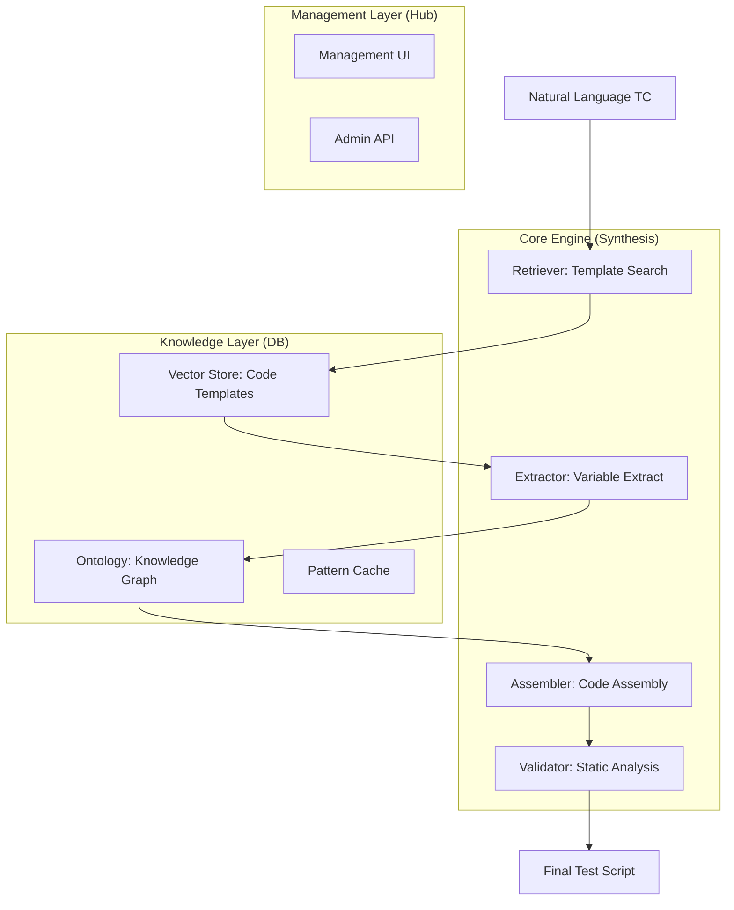

본 문서는 궁극적인 확장성과 관리 편의성을 달성하기 위한 **Vector DB 기반의 지능형 아키텍처**와 시스템 구조를 정의합니다. 특정 언어나 프레임워크에 종속되지 않고, 데이터와 지식 베이스를 기반으로 자연어 테스트 케이스를 실행 가능한 스크립트로 직접 합성(Direct Synthesis)하는 아키텍처를 정의합니다.

사용자님의 제안에 따라 설계된 독립적 지능형 시스템 설계 방안입니다.

## 1. 핵심 철학: "Direct Synthesis from Data"
본 아키텍처는 모든 번역 로직을 **데이터(Template & Ontology)**로 분리하여 관리합니다. 
*   **No Intermediate Objects**: 추상적인 중간 객체(IR) 단계를 거치지 않고, 템플릿 검색과 변수 추출을 통해 타겟 코드를 즉시 생성합니다.
*   **Scale by Knowledge**: 시스템의 지능은 코딩이 아닌 DB에 지식을 추가함으로써 확장됩니다.


## 2. 지능형 아키텍처 (Vector DB 기반 매핑)

### 3.1. 핵심 아이디어
어댑터 코드를 작성하는 대신, **"자연어 TC 문장(Step)과 해당 코드가 어떻게 매핑되어야 하는지에 대한 '정답지'를 DB에 저장하고 검색하는 방식"**입니다.
테스트 케이스의 문장은 띄어쓰기나 조사가 조금 다를 뿐, 의미적으로는 유사한 패턴이 반복된다는 점을 이용합니다.

### 3.2. 동작 시나리오 (Workflow)

1.  **벡터 스토어(Vector DB) 및 컬렉션 구축**:
    *   **컬렉션(Collection) 분리**: `SIMVA_Collection`, `CAPL_Collection` 등 실행 타겟별로 아예 독립된 물리적/논리적 DB를 사용합니다. (따라서 각 데이터에 `target`이라는 명시적인 메타데이터를 저장할 필요가 없습니다.)
    *   **DB 스키마**: `[TC 문장 원형(Source)]` + `[Target Code 템플릿]` + `[변수 메타데이터]` 형태로 저장.
    *   *예시 (SIMVA Collection 내부)*:
        *   TC Vector (검색용 원본): `"속도를 {val}으로 설정해라"`
        *   Target Code Template: `simva.set_signal("VehicleSpeed", {val})`
    *   *예시 (CAPL Collection 내부)*:
        *   TC Vector (검색용 원본): `"속도를 {val}으로 설정해라"`
        *   Target Code Template: `setSignal(VehicleSpeed, {val});`

2.  **새로운 TC 입력 시 (실행 시점)**:
    *   사용자가 Excel/TSV에서 `"현재 속도는 100 으로 설정한다."`라는 문장을 입력.
    *   Core Engine은 이 문장을 **Vector Embedding**화하여 Vector DB에 쿼리(Similarity Search).

3.  **유사 문장 매칭 및 템플릿 획득**:
    *   DB는 가장 의미가 유사한 기존 문장(`"속도를 {val}으로 설정해라"`)과 그 코드를 반환 (Cosine Similarity 기준 가장 높은 값).

4.  **변수값 추출 및 치환 (Variable Entity Extraction)**:
    *   검색된 기준 문장과 실제 입력 문장을 비교하여 `val = 100`이라는 실젯값을 추출해냅니다.
    *   추출된 값을 Template의 `{val}` 자리에 치환합니다.
        *   결과: `simva.set_signal("VehicleSpeed", 100)`

## 3. 지능형 데이터 합성 파이프라인 (Direct Synthesis)
본 아키텍처는 중간 매개 단계 없이 자연어로부터 실행 가능한 코드를 즉시 합성하여 변환 효율을 극대화합니다.

*   **파이프라인 흐름**: `자연어 TC -> Vector DB 검색 -> 변수(Entity) 추출 -> 템플릿 슬로팅(Slotting) -> 최종 스크립트`
*   **핵심 이점**:
    *   **Direct Mapping**: 정답지(코드 템플릿)가 각 타겟 툴의 규격에 맞춰 DB에 이미 존재하므로 별도의 변환 오버헤드가 없습니다.
    *   **High Fidelity**: 추출된 변수들을 검증된 템플릿에 즉시 주입(Slotting)하여 코드 생성이 빠르고 안정적입니다.

## 4. 전체 시스템 구조 (System Architecture)



### 4.1. 핵심 모듈별 역할

#### 4.1.1. Retriever (검색 엔진)
*   사용자 문장의 '의도'를 파악하여 가장 적합한 코드 뼈대(Template)를 Vector Store에서 찾아옵니다.
*   단순 행위(Action)뿐만 아니라 제어 구조(If, Loop) 문장에 대한 메타 템플릿 검색을 수행합니다.

#### 4.1.2. Extractor (변수 추출기)
*   찾아낸 템플릿과 입력 문장을 대조하여 시그널 명칭, 값, 단위 등을 추출합니다.
*   **하이브리드 전략**: 정규식(Deterministic) ➔ 문자열 차분(Alignment) ➔ 소형 언어 모델(Semantic) 순으로 정확도와 유연성을 확보합니다.

#### 4.1.3. Assembler (코드 합성기)
*   추출된 논리적 변수를 Ontology DB를 통해 특정 차종/환경의 물리적 데이터로 변환합니다.
*   복합 문장의 경우 재귀적(Recursive)으로 하위 컴포넌트를 합성하여 최종 스크립트 블록을 완성합니다.

#### 4.1.4. Validator (자동 검증기)
*   합성된 코드가 구문(Syntax)에 맞는지, 호출하는 시그널이 실제 환경에 존재하는지 검증합니다.
*   오류 발견 시 에러 내용을 분석하여 다시 합성 단계로 피드백을 보내는 자가 복구(Self-correction)를 수행합니다.

### 4.2. 권장 프로젝트 구조

```text
/nextgen-automation
├── src/                        # 애플리케이션 소스 코드 루트
│   ├── core/                   # 🧠 핵심 지능형 합성 엔진 (Core Engine)
│   │   ├── retriever.py        # Vector DB 유사도 검색 및 템플릿 반환
│   │   ├── extractor.py        # 3-Tier 하이브리드 변수 추출기 (Regex -> Diff -> LLM)
│   │   ├── assembler.py        # 추출된 변수와 템플릿 조립기 (Recursive Builder)
│   │   ├── validator.py        # Pydantic 기반 구문/타입 검증기
│   │   └── llm_provider.py     # 다중 LLM 연동 팩토리 (LangChain 기반)
│   ├── api/                    # 🌐 Management Hub 관리 API 서버 (FastAPI 등)
│   │   ├── routes/             # 엔드포인트 분리 (e.g. /batch, /templates, /ontology)
│   │   └── dependencies.py     # DI 컨테이너 및 DB 세션 관리
│   ├── db/                     # 🗄️ 지식 베이스 접근 레이어 (DAL)
│   │   ├── vector_store.py     # ChromaDB 래퍼 및 임베딩 로직
│   │   └── ontology_graph.py   # NetworkX/Neo4j 지식 그래프 래퍼 및 매퍼
│   ├── prompts/                # 📝 프롬프트 엔지니어링 템플릿 모음
│   │   ├── fallback_extractor.jinja
│   │   ├── ontology_router.yaml
│   │   └── self_correction.jinja
│   └── models/                 # 📦 Pydantic DTO (DTOs, DB 스키마)
│       ├── dto.py              # ExtractedVariables, NormalizedEntity 등
│       └── db_schema.py        # SQLAlchemy 기반 RDB 모델 (로깅, 설정용)
├── ui/                         # 🖥️ Management Hub 프론트엔드 (React / Vue 등)
│   ├── components/             # 대시보드, 템플릿 빌더 캔버스 모듈
│   └── views/                  # Approval Queue, Trace Analyzer 화면
├── data/                       # 💾 로컬 영구 저장소 및 파일 I/O
│   ├── inputs/                 # 사용자 업로드 TC 엑셀 파일 보관소
│   ├── outputs/                # 변환 완료된 최종 스크립트(.py 등) 결과물
│   └── vector_db_storage/      # ChromaDB 로컬 DB 파일 보관 경로 (gitignore 권장)
├── tests/                      # 🧪 단위 및 통합 테스트 환경 (pytest)
│   ├── test_extractor.py
│   └── test_assembler.py
├── config/                     # ⚙️ 시스템 설정 관리 모듈 (.env 로드 및 핫-리로드 기능)
│   └── settings.py
├── requirements.txt            # 파이썬 의존성 패키지 목록
└── .env.example                # 환경 변수 템플릿 (API 키, DB 경로 등)
```

> [!IMPORTANT]
> 본 설계는 **'데이터가 곧 로직'**인 시스템입니다. 코드는 데이터를 정교하게 제어하는 파이프라인 역할에 충실해야 하며, 도메인 지식은 온전히 DB 레이어에서 관리되어야 합니다.

## 5. 핵심 난제 해결방안: 동적 변수 추출 (Variable Extraction)
템플릿 매칭 자체는 Vector DB(유사도 검색)로 해결되지만, `"현재 속도는 100 으로 설정한다"`라는 새로운 입력에서 **`100`**이라는 값을 동적으로 추출하여 `{val}`에 매핑하는 것이 이 시스템의 가장 큰 기술적 한계점(허들)입니다. 이를 극복하기 위해 **하이브리드 3-Tier 추출 전략**을 설계합니다.

### 5.1. Tier 1: 정규식 기반 템플릿 역치환 (Regex Named Capture) - [가장 빠름]
Vector DB에 문장과 코드를 저장할 때, **정규식(Regex)** 템플릿도 미리 함께 저장해 둡니다.
- **Data Schema**:
  - TC 템플릿 (검색용): `"속도를 {val}으로 설정해라"`
  - Regex 템플릿 (추출용): `^.*속도를\s+(?P<val>.+?)(?:으로\s+설정).*$`
- **동작 방식**: 
  Vector DB에서 유사 문장을 찾으면, 그 메타데이터에 있는 Regex 템플릿을 꺼내와 입력 문장에 정규식 `match()`를 시도합니다. 매칭에 성공하면 `(?P<val>...)` 그룹에서 실제 값(Entity)을 100%의 정확성으로 0.001초 내에 추출합니다.

### 5.2. Tier 2: Sequence Alignment (문자열 차분 분석 알고리즘)
정규식이 실패했을 경우 동작합니다 (예: 조사가 누락되거나 어순이 살짝 바뀐 경우).
Git의 `diff` 알고리즘과 원리가 같으며, 두 문장의 LCS(Longest Common Subsequence)를 구한 뒤 일치하지 않는 텍스트 덩어리를 `[변수]` 후보로 간주하여 `{val}` 자리에 밀어 넣습니다.
- **예시**:
  - `속도를` [X] `으로 설정해라` (DB) vs `현재 속도는` [100] `설정할것` (Input)
  - 차이점인 `100`을 변수로 추출.

### 5.3. 경량화 언어모델(SLM) 기반 Entity 추출 - [가장 유연함]
위의 결정론적(Deterministic) 방식이 모두 실패할 만큼 완전히 구문이 꼬인 경우(예: `"100을 타겟 속도로 맞춰주세요"`) 사용되는 최후의 보루입니다.
문맥 이해가 뛰어난 Llama 3 (8B) 또는 소형 오픈소스 모델에게 **추출 임무만을 지시**합니다.
- **동작 방식**:
  - Prompt: `기준 문장 "속도를 {val}으로 설정해라"를 바탕으로, 실제 입력 "100을 타겟 속도로 맞춰주세요"에서 {val}에 들어갈 값을 JSON으로 추출하시오.`
  - Output: `{"val": "100"}`
- **단점**: 추론(API) 시간 및 리소스 소모. (따라서, Tier 1, 2에서 90%를 컷오프하고 남은 10%에만 이를 적용합니다).

### 5.4. 단일 지식 그래프(Knowledge Graph) 기반 Ontology DB 설계
사용자님의 통찰처럼 "온톨로지(Ontology)"의 본질은 정보의 단순 나열이 아니라 **엔티티(Entity) 간의 관계(Relationship)를 정의**하는 것입니다. 차종별로 파일을 여러 개로 쪼개게 되면, 전체 도메인의 관계망(Context)을 한눈에 파악하기 어렵고 파일 관리가 오히려 번거로울 수 있습니다.

따라서 여러 파일로 쪼개는 방식 대신, **단일 지식 그래프(Single Knowledge Graph)** 형태의 통합 구조로 통합 Ontology DB를 설계합니다.

*   **설계 구조 (Unified Graph JSON)**:
    - JSON의 단일 루트(`ontology_nodes`) 아래에 모든 **개념(Concept)**, **물리 신호(Physical Signal)**, **차종(Variant)**을 독립적인 '노드(Node)'로 선언합니다.
    - 각 노드는 자신과 연결된 다른 노드들을 `relationships` (엣지, Edge)로 명시하여 그물망처럼 연결됩니다.
    
*   **동작 원리 (Graph Traversal)**:
    1.  Core Engine이 **대상 차종(예: Variant:CarModel_B)** 컨텍스트를 주입합니다.
    2.  Vector DB 파싱: 자연어 `{signal_raw} = "차량 속도"` 추출.
    3.  Ontology 그래프 진입: `"차량 속도"` 동의어를 가진 1차원 노드 탐색 -> **`Concept:VehicleSpeed`** 도달.
    4.  그래프 순회(Traversal): 해당 노드의 `implemented_by` 관계를 탐색.
    5.  컨텍스트 매칭: 주어진 차종(`Variant:CarModel_B`) 조건에 부합하는 타겟 노드인 **`Physical:ADCU_V_Speed_Main`** 도달.
    6.  해당 노드의 물리적 실체인 `{ecu} = "ADCU"`, `{signal_id} = "V_Speed_Main"` 반환.

*   **설계의 핵심 가치 (Why a Single Graph is Better)**:
    - **가시성(Visibility)**: 단일 JSON 구조 내에 "논리적 개념", "차종", "물리적 신호"가 모두 노드로 정의되어 있으므로, 개발자나 도메인 전문가가 도메인 전체의 관계망을 직관적으로 조망할 수 있습니다.
    - **관계의 확장성(Extensibility)**: 향후 `related_concepts` (연관 신호), `depends_on` (의존 신호) 등의 다양한 관계(Relationship)를 자유롭게 추가할 수 있어, 단순 번역기를 넘어선 **'차량 도메인 지식 베이스'**로 발전할 수 있습니다.
    - **관리의 용이성**: 차원(Dimension)이 늘어나도 파일 개수가 폭증하지 않으며, 그래프 DB(예: Neo4j)로 마이그레이션하기도 매우 용이한 포맷입니다.

## 6. 복합 제어 로직 (If-Else / Loop) 처리 방안
단순한 1-Depth Action 문장이 아닌, 조건문이나 반복문과 같은 복합 구문은 **"재귀적 메타-템플릿(Recursive Meta-Template) 검색"** 알고리즘을 통해 해결합니다. Vector DB에는 단일 Action뿐만 아니라 문장의 뼈대(구조) 역할을 하는 템플릿도 별도로 구축됩니다.

### 6.1. 조건문 (If-Else) 예시 및 처리 과정
- **Target TC**: `"차량 속도가 10 km/h 이상이면 도어를 잠근다. 그렇지 않으면 도어를 해제한다."`
- **1차 쿼리 (가장 유사한 뼈대 문장 매칭)**:
  - Vector DB 반환 템플릿: `"{condition} 이면 {true_action} 한다. 그렇지 않으면 {false_action} 한다."`
  - Code Template (SIMVA 컬렉션 기준):
    ```python
    if {condition}:
        {true_action}
    else:
        {false_action}
    ```
- **하이브리드 변수 추출 (Section 6 활용)**:
  - `condition` = `"차량 속도가 10 km/h 이상"`
  - `true_action` = `"도어를 잠근다"`
  - `false_action` = `"도어를 해제한다"`
- **2차 쿼리 (재귀적 하위 탐색)**: 
  Core Engine은 변수로 추출된 3개의 문자열에 대해 **다시 Vector DB를 개별적으로 쿼리**합니다.
  - 1️⃣ `"차량 속도가 10 km/h 이상"` 쿼리 -> `simva.get_signal("VehicleSpeed") >= 10` (치환됨)
  - 2️⃣ `"도어를 잠근다"` 쿼리 -> `simva.set_signal("DoorLock", 1)` (치환됨)
  - 3️⃣ `"도어를 해제한다"` 쿼리 -> `simva.set_signal("DoorLock", 0)` (치환됨)
- **최종 코드 조립**: 모든 하위 노드가 순수 코드로 치환된 후 최상위 템플릿에 합쳐집니다.

### 6.2. 반복문 (Loop) 및 순차문 (Sequence) 복합 예시
- **Target TC**: `"와이퍼를 LOW로 설정하고 2초 대기하는 동작을 3회 반복한다."`
- **1차 쿼리 (Loop 뼈대 매칭)**: `"{action} 동작을 {count}회 반복한다."`
  - Code Template: 
    ```python
    for _ in range({count}):
        {action}
    ```
  - 추출 변수:
    - `count` = `"3"`
    - `action` = `"와이퍼를 LOW로 설정하고 2초 대기하는"`
- **2차 쿼리 (Sequence 뼈대 매칭)**: `"와이퍼를 LOW로 설정하고 2초 대기하는"`에 대한 DB 매칭:
  - Vector DB 템플릿: `"{action_a} 하고 {action_b} 하는"`
  - 추출 변수:
    - `action_a` = `"와이퍼를 LOW로 설정"`
    - `action_b` = `"2초 대기"`
- **3차 쿼리 (단일 Action 매칭)**:
  - `"와이퍼를 LOW로 설정"` -> `simva.set_signal("Wiper", "LOW")`
  - `"2초 대기"` -> `simva.wait(2000)`
- **최종 조립 결과**:
  ```python
  for _ in range(3):
      simva.set_signal("Wiper", "LOW")
      simva.wait(2000)
  ```

### 6.3. 설계 의의
이와 같이 "제어 구조(Meta)"와 "구체적 행동(Action)"을 독립된 Vector 데이터로 저장함으로써, **"A이면 B한다"**, **"C를 D번 한다"**의 조합 경우의 수를 DB에 일일이 넣지 않아도(N * M의 곱연산 방지) 무한한 TC 조합을 처리할 수 있는 뛰어난 모듈성을 얻게 됩니다.

