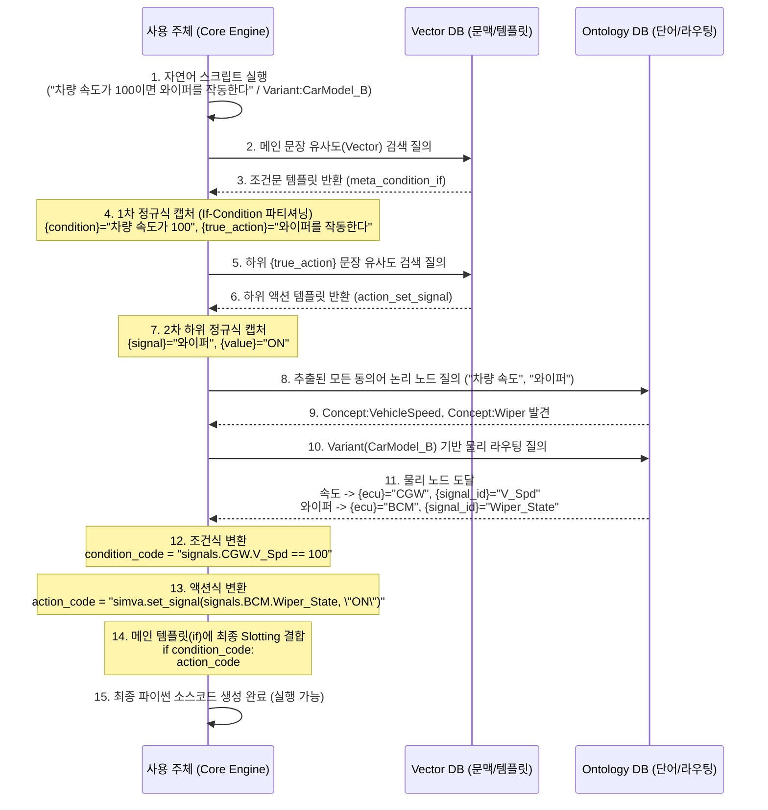
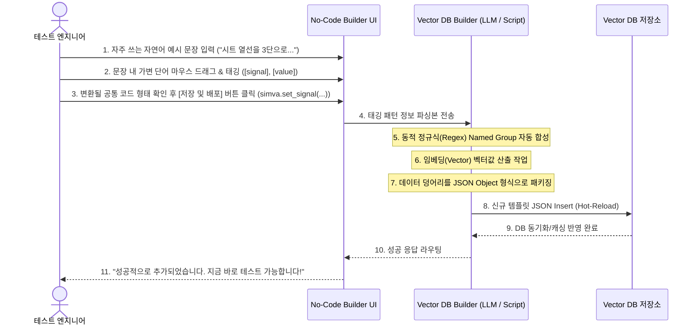
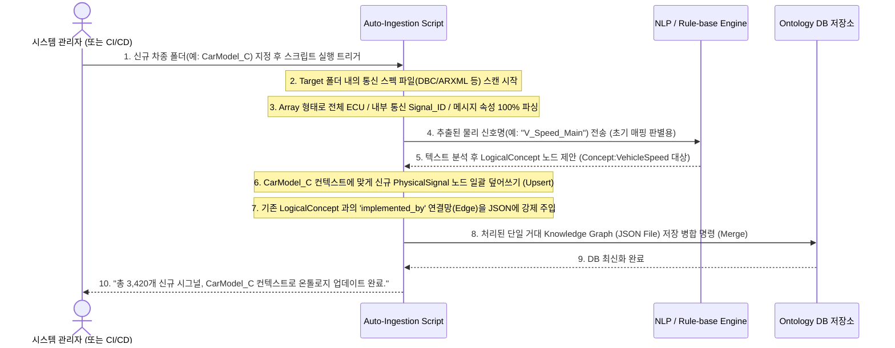

# 아키텍처 실행 시퀀스 다이어그램 (Sequence Diagram)

이 문서는 새롭게 분리된 **Vector DB (문법/뼈대)**와 **Ontology DB (단어/번역)** 간의 상호작용 흐름과 각 자동화 파이프라인이 어떤 순서로 동작하는지 직관적인 시퀀스 다이어그램으로 설명합니다.

---

## 1. 코어 변환 시퀀스 (Testing / Execution Phase - 조건/루프 제어문 예시)
테스트 엔지니어가 복합적인 조건 제어가 포함된 자연어 테스트 스크립트를 실행했을 때, 메인 뼈대를 잡고 내부 하위 문장(액션)까지 재귀적(Recursive)으로 번역되어 최종 코드로 조립되는 과정입니다.

---

## 2. Vector DB 유지보수 시퀀스 (Zero-Code Generation Phase)
테스트 엔지니어가 평소 쓰던 문구를 템플릿 빌더 UI (Web/Desktop)에서 드래그하여 새로운 규칙을 Vector DB에 등록하는 과정입니다.

---

## 3. 온톨로지 유지보수 확장 시퀀스 (Auto-Ingestion Phase)
새로운 차종(Variant)이 산출되거나 물리 통신 신호 스펙(DBC/ARXML)이 변경되었을 때, 인간이 단 한 줄의 JSON도 수정하지 않고 온톨로지 DB가 자동 갱신되는 100% 자동화 파이프라인입니다.

