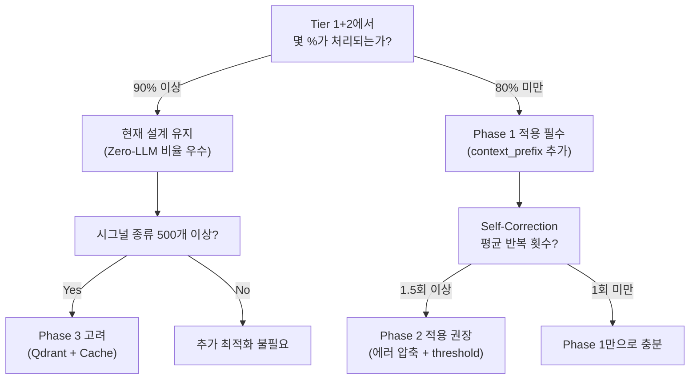

# Contextual RAG 기반 토큰 비용 최적화 전략

본 문서는 `03_advanced_design`에서 설계된 **Direct Synthesis 아키텍처**의 각 모듈에서 RAG 호출 시 발생하는 토큰 비용을 분석하고, Contextual RAG(Hybrid RAG) 방식으로 토큰 소비를 최소화하는 전략을 제시합니다.

> [!NOTE]
> 본 문서의 모든 참조는 현재 구현 코드가 아닌, 아래 설계 문서들을 기준으로 작성되었습니다.
> - [architecture_design.md] — Retriever → Extractor → Assembler → Validator 파이프라인
> - [prompt_engineering_guide.md] — Tier 3~4 LLM 프롬프트 설계
> - [tc_script_generation_strategy.md] — 컬럼별 라우팅 및 값 정규화 파이프라인
> - [db/vector_db_schema.md] — Vector DB 스키마
> - [db/ontology_db_schema.md] — Ontology Knowledge Graph 스키마

---

## 1. 현재 설계에서의 LLM 호출 지점과 토큰 비용 분석

`architecture_design.md`의 Direct Synthesis 파이프라인에서 LLM이 호출되는 시점은 **3곳**입니다. 모든 구간이 Full Context로 동작하면 토큰 부담이 커집니다.

### 1.1 LLM 호출 지점 맵 (설계 기준)

```
자연어 TC Step
    │
    ├── ① Retriever (Vector DB 검색) ──────── LLM 미사용 (Embedding 유사도만)
    │
    ├── ② Extractor (변수 추출)
    │     ├── Tier 1: Regex Named Capture ──── LLM 미사용 ✅
    │     ├── Tier 2: Sequence Alignment ───── LLM 미사용 ✅
    │     └── Tier 3: SLM Fallback ─────────── 🔴 LLM 호출 (prompt_engineering_guide §2-1)
    │
    ├── ③ Assembler (Ontology 라우팅)
    │     ├── Graph Traversal ──────────────── LLM 미사용 ✅
    │     └── Alias 미매칭 시 ──────────────── 🔴 LLM 호출 (prompt_engineering_guide §2-2)
    │
    └── ④ Validator (코드 검증)
          ├── ast.parse() 정적 분석 ─────────── LLM 미사용 ✅
          └── Self-Correction Loop ──────────── 🔴 LLM 호출 (prompt_engineering_guide §2-3)
```

### 1.2 호출별 예상 토큰 비용

| 호출 지점 | 프롬프트 구성 (prompt_engineering_guide 기준) | 예상 토큰/호출 | 빈도 |
| :--- | :--- | ---: | :--- |
| **Tier 3 Extractor** | System(Few-shot 2개) + User(입력+템플릿) | ~600 tokens | Step의 ~10% |
| **Ontology Router** | System(Alias 매핑 규칙) + User(미매칭 은어+후보 리스트) | ~800 tokens | Step의 ~5% |
| **Self-Correction** | System(수정 규칙) + User(원본 TC+기존 코드+에러 로그) | ~1,500 tokens | TC의 ~15% |
| **Template Rescue** | System(패턴 유추 가이드) + User(미등록 문장) | ~1,000 tokens | Step의 ~3% |

> [!IMPORTANT]
> 현재 설계의 **3-Tier Extractor** 덕분에, **90%의 Step은 LLM 없이(Zero-LLM)** 처리됩니다. 토큰 최적화의 핵심은 나머지 10%에서 호출되는 LLM의 입력 토큰을 줄이는 것과, **Self-Correction Loop의 반복을 최소화**하는 것입니다.

---

## 2. Contextual RAG로 각 모듈의 토큰을 절감하는 전략

### 2.1 Vector DB의 Contextual Indexing (Stage 1 — 오프라인, 1회성)

`vector_db_schema.md`에 정의된 현재 스키마에 **`context_prefix`** 필드를 추가하여, 검색 정확도를 높이고 Tier 3 Fallback 빈도 자체를 줄입니다.

**현재 Vector DB 스키마** (`vector_db_schema.md` §2.1):
```json
{
  "id": "action_set_signal",
  "type": "ACTION",
  "vector_source": "{signal}를 {value}로 설정한다",
  "regex_pattern": "^.*?(?P<signal>...)...$",
  "variables": ["signal", "value"],
  "target_code": "simva.set_signal(signals.{ecu}.{signal}, \"{value}\")"
}
```

**Contextual RAG 적용 후 스키마 확장안**:
```json
{
  "id": "action_set_signal",
  "type": "ACTION",
  "context_prefix": "차량 제어 시그널의 상태값을 변경하는 일반적인 할당 동작. 도어, 램프, 와이퍼, 기어 등 모든 ECU 신호에 적용 가능하며, 조건문 내부의 하위 액션으로도 빈번히 사용됨.",
  "vector_source": "{signal}를 {value}로 설정한다",
  "full_text_for_embedding": "차량 제어 시그널의 상태값을 변경하는 ... {signal}를 {value}로 설정한다",
  "regex_pattern": "^.*?(?P<signal>...)...$",
  "variables": ["signal", "value"],
  "target_code": "simva.set_signal(signals.{ecu}.{signal}, \"{value}\")"
}
```

**효과**:
- `context_prefix`가 임베딩에 포함되므로, 은어·축약어를 사용한 TC 문장도 더 높은 유사도(Score)로 정확한 템플릿에 매칭됩니다.
- **Tier 3 SLM Fallback 호출 빈도 감소** (추정 10% → 3~5%) → 토큰 절감

---

### 2.2 Ontology Router의 Precision Filtering (Stage 2 — 런타임)

`prompt_engineering_guide.md` §2-2의 Ontology Router 프롬프트에서 **모든 후보 노드**를 LLM에 전송하는 대신, Graph Traversal 결과를 사전 필터링하여 후보 수를 줄입니다.

**현재 설계 (Full Context)**:
Ontology Router가 호출될 때, 지식 그래프 내 **전체 Concept 노드 리스트**를 후보로 전달:
```text
[Ontology Router User Prompt]
미매칭 은어: "악셀"
전체 후보 목록: VehicleSpeed, DoorLock, SeatBelt_Warning, HeadLamp, TailLamp,
                Wiper_Status, IG_Status, Gear_Status, HazardLamp, ... (수십~수백 개)
```
→ 후보가 많을수록 **Input 토큰 증가** (~800+ tokens)

**Contextual RAG 적용 (Precision Filtering)**:
1단계로 Ontology Graph의 `synonyms` 필드에서 **문자열 유사도(fuzzy match)**로 Top-5 후보를 먼저 필터링한 뒤, LLM에는 소량의 후보만 전달합니다.

```text
[Ontology Router User Prompt — 최적화 후]
미매칭 은어: "악셀"
후보 (Top-5 fuzzy match): 
  1. VehicleSpeed (synonyms: 차속, 속도, 스피드)
  2. AccelPedal (synonyms: 가속 페달, 엑셀)
  3. Gear_Status (synonyms: 기어, 변속)
```
→ **Input 토큰 ~300 tokens로 감소** (약 62% 절감)

---

### 2.3 Self-Correction Loop의 에러 컨텍스트 압축 (Stage 3 — 런타임)

`prompt_engineering_guide.md` §2-3 Self-Correction 프롬프트에서 가장 토큰을 많이 소모하는 부분은 **에러 트레이스백(Traceback) 전문**과 **이전 코드 전문**입니다.

**현재 설계 (Full Context)**:
```text
[이전 수립 코드]: (전체 TC 함수 코드 ~30줄)
[발생한 에러 로그]: (Python traceback 전문 ~15줄)
```
→ **~1,500 tokens/호출**, 최대 3회 반복 시 ~4,500 tokens

**Contextual RAG 적용 (Error Context Summarization)**:
- 에러 트레이스백에서 **마지막 프레임(최종 원인)만 추출**
- 이전 코드에서 **에러가 발생한 줄 ±3줄만 발췌**

```text
[에러 요약]: Line 12에서 NameError: 'Wiper_Staus' is not defined (오타 의심)
[에러 주변 코드]:
  L10:     simva.set_signal(signals.BCM.DoorLock, "LOCKED")
  L11:     simva.wait(2.0)
  L12: >>> simva.set_signal(signals.BCM.Wiper_Staus, "LOW")   # <-- 에러
  L13:     result = simva.is_eq(signals.BCM.Wiper_Status, "LOW")
```
→ **~500 tokens/호출로 감소** (약 67% 절감), 3회 반복해도 ~1,500 tokens

---

## 3. 비용 절감 효과 종합

### TC 1건(평균 5 Step + Expected Result) 기준 시뮬레이션

| 호출 지점 | Full Context (현재 설계) | Contextual RAG (최적화) | 절감율 |
| :--- | ---: | ---: | ---: |
| Tier 3 Extractor (빈도 10%→5%) | 600 × 0.6회 = 360 | 600 × 0.3회 = **180** | 50% |
| Ontology Router (빈도 5%→3%) | 800 × 0.3회 = 240 | 300 × 0.18회 = **54** | 78% |
| Self-Correction (빈도 15%) | 1,500 × 0.9회 = 1,350 | 500 × 0.6회 = **300** | 78% |
| Template Rescue (빈도 3%) | 1,000 × 0.18회 = 180 | 1,000 × 0.1회 = **100** | 44% |
| **소계 (LLM 토큰)** | **~2,130 tokens** | **~634 tokens** | **~70% ↓** |

> [!TIP]
> 주의: 위 수치는 LLM이 호출되는 Fallback 경로의 토큰만 계산한 것입니다. Tier 1(Regex) + Tier 2(Alignment) 경로는 **LLM을 전혀 사용하지 않으므로** 토큰 비용이 0입니다. 이것이 현재 설계의 가장 큰 장점입니다.

---

## 4. 마이그레이션 로드맵

### Phase 1 — 즉시 적용 (설계 문서 수정만)

| 작업 | 대상 설계 문서 | 효과 |
| :--- | :--- | :--- |
| Vector DB 스키마에 `context_prefix` 필드 추가 | `db/vector_db_schema.md` | 검색 정확도 향상, Tier 3 빈도 감소 |
| Ontology Router 프롬프트에 fuzzy Top-5 사전 필터링 명시 | `prompt_engineering_guide.md` §2-2 | 후보 토큰 62% 절감 |
| Self-Correction 프롬프트에 에러 요약 전략 반영 | `prompt_engineering_guide.md` §2-3 | 에러 토큰 67% 절감 |

### Phase 2 — 구현 시점

| 작업 | 대상 모듈 (신규) | 효과 |
| :--- | :--- | :--- |
| `contextual_indexer.py` — 배치 인덱싱 시 LLM으로 `context_prefix` 자동 생성 | `src/db/` | 오프라인 1회 비용으로 운영 시 정확도 획기적 향상 |
| `retriever.py`에 `score_threshold` 도입 — 0.75 미만 결과 자동 폐기 | `src/core/` | 노이즈 템플릿 유입 방지 |
| `validator.py`에 에러 컨텍스트 압축 로직 (±3줄 발췌) 추가 | `src/core/` | Self-Correction 토큰 67% 절감 |

### Phase 3 — 대규모 확장 시

| 작업 | 효과 |
| :--- | :--- |
| 배치 Step 처리 시 **Step History Summary** 동적 주입 | 재귀적 문맥 파악 향상 (복합 조건문 정확도) |
| ChromaDB → Qdrant 마이그레이션 | 대량 컬렉션 검색 레이턴시 감소 |
| `Pattern Cache` 레이어 도입 (`architecture_design.md` §4 참조) | 동일 패턴 반복 호출 완전 제거 |

---

## 5. 의사결정 가이드



> [!NOTE]
> 현재 설계의 **3-Tier Extractor + Ontology Graph Traversal** 조합은 이미 LLM 호출을 극도로 억제하는 구조입니다. Contextual RAG는 이 위에 **나머지 10% Fallback 경로의 효율**을 극대화하는 보완 전략으로 위치합니다.
