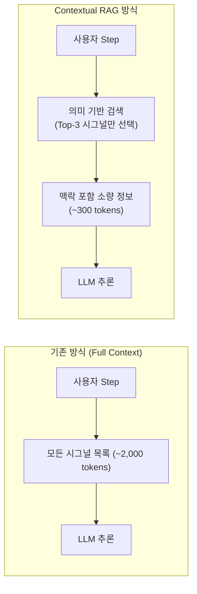
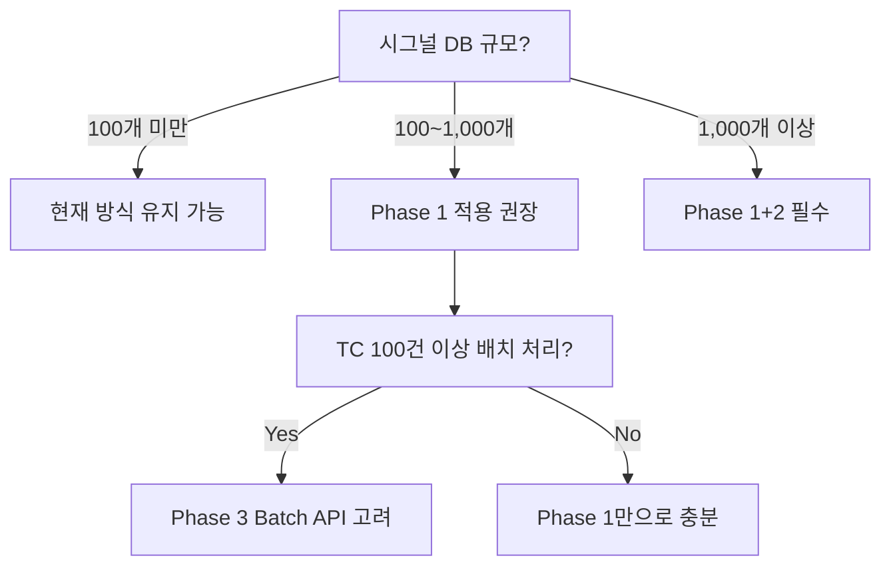

# Contextual RAG 기반 토큰 비용 최적화 전략

본 문서는 현재 TestScriptGenerator가 채택한 Full Context Window 방식의 토큰 비용 문제를 분석하고, Contextual RAG(Hybrid RAG) 방식으로 전환하여 정확도는 유지하면서 토큰 소비를 대폭 줄이는 아키텍처 전략을 기술합니다.

---

## 1. 현재 방식(Full Context)의 토큰 비용 문제 진단

현재 `prompt_builder.py`의 `build_prompt()` 함수는 Vector DB에서 찾은 **모든 시그널 매칭 결과**와 **온톨로지 규칙 전체**를 매 Step 호출마다 CONTEXT 섹션에 통째로 주입합니다.

### 문제 구조 (현재)

```
[매 Step LLM 호출 시 프롬프트 구성]
├── System Prompt (IR 스키마, Rules)  ~1,500 tokens (고정)
├── [CONTEXT] RAG 시그널 결과         ~500~2,000 tokens (가변, 검색된 전체 시그널 목록)
├── [CONTEXT] Ontology 규칙            ~300~1,000 tokens (가변, 현재 없어도 주입)
└── 사용자 Step 텍스트                  ~30~100 tokens
                                      ─────────────────
Total per Step call                   ≈ 2,300 ~ 4,600 tokens
```

### 비용 시뮬레이션

하나의 TC(평균 5 Step + Expected Result 1건 = 6회 호출) 기준:

| 항목 | 현재 Full Context | 목표 Contextual RAG |
| :--- | ---: | ---: |
| Step당 Platform 토큰 (Input) | ~3,000 tokens | ~800 tokens |
| TC 1건 기준 총 Input 토큰 | **~18,000 tokens** | **~4,800 tokens** |
| 100개 TC 처리 시 Input | **~1,800,000 tokens** | **~480,000 tokens** |
| 예상 비용 절감율 | — | **약 73% 절감** |

> [!IMPORTANT]
> 시그널 DB가 5개 제어기(ECU) 수준으로 성장하면 CONTEXT 섹션이 5,000 토큰을 초과할 수 있습니다. 이 시점에서 Full Context 방식은 비용과 속도 양면에서 실용적 한계에 도달합니다.

---

## 2. Contextual RAG 아키텍처의 핵심 개념

단순한 청크 분할(Chunking) + 유사도 검색과 달리, **Contextual RAG는 각 데이터 조각이 전체 문서에서 가지는 맥락(Context)을 사전에 처리하여 저장**합니다. 검색 시 맥락이 이미 포함된 데이터를 반환하므로, LLM에 소량의 정제된 정보만 전달해도 전체 이해가 가능합니다.



---

## 3. 3단계 Hybrid RAG 파이프라인 설계

현재 프로젝트에 `HybridRAGEngine`이 이미 존재합니다 (`src/core/rag_engine.py`). 이 엔진을 기반으로 다음 3단계 파이프라인을 구성합니다.

### Stage 1: 전처리 — Contextual Indexing (오프라인, 1회성)

시그널 사양서를 Vector DB에 넣기 전, 각 시그널 청크에 LLM이 생성한 **맥락 설명**을 사전에 붙여놓습니다.

**현재 DB 인덱싱 방식 (문제)**:
```json
{
  "id": "Door_Status",
  "text": "Door_Status | BDC | enum: OPEN, CLOSED, LOCKED",
  "embedding": [...]
}
```

**개선된 Contextual 인덱싱 방식**:
```json
{
  "id": "Door_Status",
  "context_prefix": "이 시그널은 BDC 제어기의 도어 잠금 상태를 나타내며, 차량 속도(VehicleSpeed)가 10km/h를 초과할 때 자동 연동됩니다.",
  "text": "Door_Status | BDC | enum: OPEN, CLOSED, LOCKED",
  "full_text_for_embedding": "이 시그널은 BDC 제어기의 도어 잠금 상태를 나타내며... Door_Status | BDC | enum: OPEN, CLOSED, LOCKED",
  "embedding": [...]
}
```

> [!TIP]
> `context_prefix`는 `架構 문서의 일부`, `연관 제어기`, `제약 조건` 등을 3~4문장으로 요약한 것입니다. 이 사전 작업은 오프라인으로 배치(Batch) 처리하므로 운영 중 추가 비용이 발생하지 않습니다.

**구현 대상 파일**: `src/db/indexer.py` (신규) 또는 `HybridRAGEngine` 내 `build_index()` 메서드 확장

```python
def contextual_index_signal(signal_entry: dict) -> dict:
    """
    각 시그널에 LLM 생성 맥락 설명을 사전 부착하는 함수.
    오프라인 배치 처리용.
    """
    prompt = f"다음 자동차 시그널 정보에 대해 전체 시스템 내 역할과 연관 신호를 3문장으로 요약하세요:\n{signal_entry}"
    context = llm.invoke(prompt)  # 최저가 모델(예: gpt-4o-mini) 사용
    signal_entry["context_prefix"] = context
    signal_entry["full_text_for_embedding"] = f"{context}\n{signal_entry['text']}"
    return signal_entry
```

---

### Stage 2: 검색 — Precision RAG (런타임, 매 Step 호출)

매 Step 처리 시, 전체 시그널 목록 대신 **의미적으로 가장 관련성 높은 상위 3~5개만** 검색하여 반환합니다.

**현재 `engine.py`의 호출 방식** (비효율적):
```python
# _process_step_with_retry 내부 (현재 추정 구조)
rag_signals = self.rag.query_signals(step["text"])  # 상위 N개 반환
rag_rules = self.rag.query_rules(step["text"])      # 전체 규칙 반환
prompt = PromptBuilder.build_prompt(step["text"], rag_signals, rag_rules)
```

**개선된 Precision RAG 방식** (토큰 절감):
```python
# top_k를 엄격하게 제한하고 score threshold 적용
rag_signals = self.rag.query_signals(
    step["text"],
    top_k=3,                  # 상위 3개만
    score_threshold=0.75      # 유사도 75% 미만은 제외
)

# 온톨로지 규칙도 관련 제어기(ECU)에 한정하여 조회
relevant_ecus = [s["ecu"] for s in rag_signals]
rag_rules = self.rag.query_rules_by_ecu(relevant_ecus)  # ECU 필터링

prompt = PromptBuilder.build_prompt(step["text"], rag_signals, rag_rules)
```

**`HybridRAGEngine`에 추가할 메서드**:
```python
def query_rules_by_ecu(self, ecu_list: list[str]) -> list[dict]:
    """
    관련 ECU에 해당하는 온톨로지 규칙만 필터링하여 반환.
    전체 규칙 대신 Step당 평균 1~2개 규칙만 LLM에 주입.
    """
    return [r for r in self.ontology_rules if r.get("ecu") in ecu_list]
```

---

### Stage 3: 주입 — Step History Summarization (토큰 절약형 맥락 유지)

이전 Step들의 내용을 전부 나열하는 대신, **누적 처리 결과를 요약한 1~2줄의 History Summary**만 프롬프트에 주입합니다.

**`engine.py`에 추가할 히스토리 요약 로직**:
```python
def _build_step_history_summary(self, processed_irs: list) -> str:
    """
    이전 Step들의 IR 결과를 1줄 요약으로 압축.
    Full Context 대신 요약만 주입하여 토큰 절약.
    
    예시 출력:
    "이전 동작 요약: [1] VehicleSpeed=50 설정, [2] Gear_Status=P 설정"
    """
    summaries = []
    for i, ir in enumerate(processed_irs, 1):
        if ir.type == "SET":
            summaries.append(f"[{i}] {ir.logical_signal}={ir.value} 설정")
        elif ir.type == "WAIT":
            summaries.append(f"[{i}] {ir.duration_sec}초 대기")
    return "이전 동작 요약: " + ", ".join(summaries) if summaries else ""
```

**`PromptBuilder.build_prompt()`에 `step_history` 파라미터 추가**:
```python
@classmethod
def build_prompt(cls, user_text, rag_signals, rag_rules,
                 is_expected_result=False,
                 step_history: str = "") -> str:
    context_str = "[CONTEXT]\n"
    
    # 히스토리 요약 (소량, ~50 tokens)
    if step_history:
        context_str += f"## 선행 Step 요약\n{step_history}\n\n"
    
    # 검색된 시그널 (상위 3개, ~200 tokens)
    context_str += "## 관련 시그널\n"
    ...
```

---

## 4. 파이프라인 전후 비교

### 토큰 구조 비교

```
[AS-IS: 현재 Full Context 방식]                [TO-BE: Contextual RAG 방식]
─────────────────────────────────────          ─────────────────────────────────────
System Prompt          : 1,500 tokens          System Prompt          : 1,500 tokens
── [CONTEXT] ──────────────────────            ── [CONTEXT] ──────────────────────
  시그널 전체 목록     : 1,500 tokens            선행 Step 요약        :    50 tokens  ▼ 절감
  온톨로지 규칙 전체   :   800 tokens            Top-3 시그널 (맥락포함):   250 tokens  ▼ 절감
                                                관련 ECU 규칙 1~2개   :   100 tokens  ▼ 절감
사용자 Step Text       :    80 tokens          사용자 Step Text        :    80 tokens
─────────────────────                          ─────────────────────
Total per call : ~3,880 tokens                 Total per call : ~1,980 tokens
                                               절감율: 약 49% ↓
```

---

## 5. 마이그레이션 로드맵

### Phase 1 — 즉시 적용 가능 (코드 수정만)

| 작업 | 대상 파일 | 예상 토큰 절감 |
| :--- | :--- | ---: |
| RAG `top_k=3`, `score_threshold=0.75` 설정 | `rag_engine.py` / `engine.py` | ~40% |
| ECU 기반 온톨로지 필터링 `query_rules_by_ecu()` 구현 | `rag_engine.py` | ~15% |
| Step History Summary 주입 | `engine.py`, `prompt_builder.py` | ~10% |
| **합계** | | **~55% 절감** |

### Phase 2 — 단기 (인덱싱 파이프라인 개선)

| 작업 | 대상 파일 | 효과 |
| :--- | :--- | :--- |
| `contextual_index_signal()` 배치 스크립트 작성 | `src/db/indexer.py` (신규) | 검색 정확도 +20% |
| 시그널 DB 재인덱싱 (맥락 prefix 추가) | `vector_db_storage/` | 오타/동의어 매칭 향상 |
| `script/rebuild_index.py` 관리 스크립트 추가 | `scripts/` (신규) | 운영 편의성 |

### Phase 3 — 중장기 (대규모 확장 시)

| 작업 | 효과 |
| :--- | :--- |
| ChromaDB → Qdrant 마이그레이션 (성능) | 검색 레이턴시 50% 감소 |
| 시그널 캐시 레이어 (`LRU Cache`) 도입 | 동일 Step 중복 호출 제거 |
| 배치(Batch) API 활용 (야간 처리) | 비용 추가 50% 절감 |

---

## 6. 의사결정 가이드

현재 상황에 따라 어떤 방식을 선택할지 결정하는 기준입니다.



> [!NOTE]
> 현재 프로젝트 규모에서는 **Phase 1 (코드 수정)만으로도 약 55%의 토큰 절감**이 가능합니다. Phase 2(인덱싱 재구성)는 시그널 종류가 200개를 넘어가는 시점에 투자 대비 효과가 극대화됩니다.
