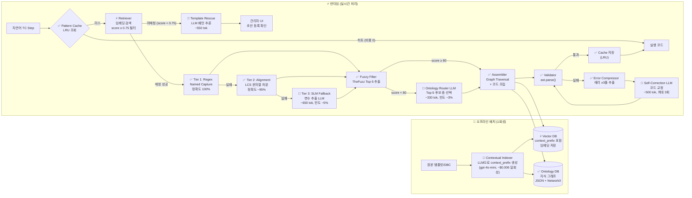

# Contextual RAG 기반 차세대 아키텍처 설계

본 폴더는 `docs/03_advanced_design`의 **Direct Synthesis 아키텍처(방안 B)**를 토대로, LLM 비용을 최소화하고 변환 정확도를 극대화하는 **방안 C (Contextual RAG)** 의 전체 설계 문서를 담고 있습니다.

---

## 📂 문서 목록

### 전략 및 아키텍처

| 문서 | 한줄 요약 |
| :--- | :--- |
| [rag_cost_optimization_strategy.md](./rag_cost_optimization_strategy.md) | **(핵심 비교 문서)** 방안 A·B·C 3가지 아키텍처의 LLM 호출 지점, Token 비용 정량 분석, 변환 정확도 비교, 단계별 전환 로드맵. TC 100건 기준 비용 시뮬레이션 포함 |
| [architecture.md](./architecture.md) | 방안 C 전체 시스템 다이어그램 및 모듈별 설계. Offline Contextual Indexer, Retriever Score Filter, Fuzzy Ontology Router, Error Context Compressor, Pattern Cache Layer |
| [execution_sequence.md](./execution_sequence.md) | 방안 C의 6가지 런타임 실행 시퀀스 다이어그램. Happy Path(LLM 0회), 재귀 메타-템플릿, Tier 3 SLM Fallback, Self-Correction+Error Compressor, Pattern Cache 히트, No-Code DB 등록 |
| [prompt_engineering_guide.md](./prompt_engineering_guide.md) | LLM이 실제로 호출되는 4개 지점의 공식 프롬프트 명세. Fuzzy Top-5 사전 필터링(Ontology Router), ±3줄 에러 압축(Self-Correction), context_prefix 주입(Tier 3), 오프라인 인덱서 |

### `db/` 서브폴더 — DB 설계 및 예시 데이터

| 파일 | 한줄 요약 |
| :--- | :--- |
| [db/vector_db_design.md](./db/vector_db_design.md) | Vector DB 상세 설계. `context_prefix` 포함 7개 필드 스키마, 컬렉션 분리 전략, Contextual Indexing 오프라인 파이프라인, Score Threshold 0.75 적용 런타임 검색 코드 |
| [db/ontology_db_design.md](./db/ontology_db_design.md) | Ontology 지식 그래프 상세 설계. Concept·Physical·Variant·Enum·Constraint 5가지 노드 스키마, 8가지 엣지 정의, Fuzzy Filter+Graph Traversal 검색 알고리즘, DBC 자동 파싱 파이프라인 |
| [db/vector_db_sample.json](./db/vector_db_sample.json) | Vector DB 예시 데이터 — 11개 템플릿 레코드 (context_prefix, regex_pattern, target_code 포함). ACTION / TYPE_WAIT / TYPE_CHECK / META_CONTROL 전 유형 커버 |
| [db/ontology_graph_sample.json](./db/ontology_graph_sample.json) | Ontology DB 예시 데이터 — 21개 노드(Variant 2, Concept 5, Physical 6, Enum 4, Constraint 2), 36개 엣지. CarModel_A(내연기관), CarModel_B(전기차) 기준 |

---

## 🏗️ 방안 C 아키텍처 한눈에 보기

> 🔴 **LLM 호출** (생성형, 고비용) | ⚡ **Embedding 모델** (저비용) | ✅ **결정론적 처리** (비용 0)

### LLM 호출 지점 요약

| 위치 | 호출 빈도 | 비용/호출 | 역할 |
| :--- | :---: | :---: | :--- |
| 🔴 Contextual Indexer | **1회성** (오프라인) | ~$0.006 전체 | 템플릿 맥락 요약 (`context_prefix`) 사전 생성 |
| 🔴 Tier 3 SLM Fallback | ~5% Step | ~650 tok | Regex·Alignment 실패 시 변수 추출 |
| 🔴 Ontology Router | ~3% Step | ~330 tok | Fuzzy score < 80 시 은어 매핑 |
| 🔴 Self-Correction | ~10% Step | ~500 tok | ast.parse() 실패 시 코드 교정 (최대 3회) |
| 🔴 Template Rescue | ~2% Step | ~550 tok | score < 0.75 미등록 패턴 추론 |
| ⚡ Retriever Embedding | 100% Step | ~0.03 tok | Vector DB 검색 (저비용, 항상 실행) |

---

## � 방안 A·B·C 핵심 지표 비교

| 지표 | 방안 A (현재) | 방안 B (03 설계) | 방안 C (본 폴더) |
| :--- | :---: | :---: | :---: |
| LLM 호출률 | 100%/Step | ~20%/Step | ~12%/Step |
| 생성형 LLM 토큰 (100TC) | 2,310K | 132K | 67K |
| **A 대비 절감율** | — | **94.3%↓** | **97.1%↓** |
| Step 변환 성공률 | ~65~70% | ~88~91% | **~93~96%** |
| 환각(Hallucination) 빈도 | ❌ 빈번 | ✅ 드묾 | ✅✅ 최소 |

> 상세 비용·정확도 분석 → [rag_cost_optimization_strategy.md](./rag_cost_optimization_strategy.md) §3~8

---

## 🗺️ 03 폴더와의 관계

| 03 설계 요소 | 방안 C에서의 변화 |
| :--- | :--- |
| Vector DB 스키마 | `context_prefix` 필드 추가 → 검색 정확도 향상 |
| Ontology Router | Fuzzy Top-5 사전 필터링 추가 → LLM 호출 시 토큰 62% 절감 |
| Self-Correction | Error Compressor 추가 → 에러 컨텍스트 ±3줄만 전달, 67% 절감 |
| Retriever | `score_threshold=0.75` 추가 → 노이즈 결과 차단 |
| (신규) Pattern Cache | 반복 패턴 즉시 반환 → 검색 자체 생략, 비용 0 |
