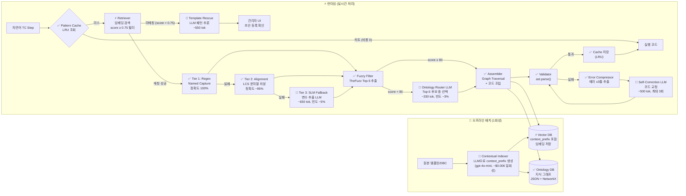

# Contextual RAG 기반 차세대 아키텍처 설계

본 폴더는 `docs/03_advanced_design`의 **Direct Synthesis 아키텍처(방안 B)**를 토대로, LLM 비용을 최소화하고 변환 정확도를 극대화하는 **방안 C (Contextual RAG)** 의 전체 설계 문서를 담고 있습니다.

---

## 📂 문서 목록

### 1. 전략 및 청사진 (Strategy & Blueprint)
시스템의 목표, 비용 절감 수치 및 전체 구조를 다루는 최상위 문서입니다.

| 문서 | 한줄 요약 |
| :--- | :--- |
| [rag_cost_optimization_strategy.md](./rag_cost_optimization_strategy.md) | **(최상위 전략)** 방안 A·B·C 비교 분석, Token 비용 시뮬레이션 및 단계적 로드맵 |
| [architecture.md](./architecture.md) | **(전체 설계도)** 시스템 다이어그램, 모듈별 역할 정의 및 연동 개요 |

### 2. 핵심 런타임 모듈 (Core Runtime Modules)
사용자 입력(TC)이 들어왔을 때 실시간으로 거치는 핵심 변환 로직들입니다.

| 문서 | 한줄 요약 |
| :--- | :--- |
| [pattern_cache_design.md](./pattern_cache_design.md) | **(조회)** 정규화 키 기반 LRU 캐시, 무효화 전략 및 자가 학습 루프 설계 |
| [extractor_design.md](./extractor_design.md) | **(추출)** 3-Tier(Regex → LCS → SLM) 변수 추출 로직 및 재귀 처리 |
| [ontology_router_design.md](./ontology_router_design.md) | **(매핑)** Fuzzy Filter(TheFuzz) 기반 신호명 매핑 및 LLM 후보 선택 프로세스 |
| [validator_design.md](./validator_design.md) | **(검증)** 2단계 검증(Syntax/Semantic) 및 Self-Correction 재시도 루프 |

### 3. 파이프라인 및 예외 처리 (Process & Ops)
데이터 구축 및 시스템이 해결 못하는 상황에 대한 대응 설계입니다.

| 문서 | 한줄 요약 |
| :--- | :--- |
| [offline_pipeline_design.md](./offline_pipeline_design.md) | **(데이터)** Contextual Indexer 파이프라인 및 Ontology DB 구축 로직 |
| [rescue_flow_design.md](./rescue_flow_design.md) | **(예외)** 검색 실패 시 Template Rescue Engine 및 No-Code UI 연동 설계 |
| [vector_db_build_pipeline.md](./vector_db_build_pipeline.md) | **(DB 구축)** 기존 TC(TSV) + 스크립트(Python)를 Input으로 Vector DB를 자동 빌드하는 파이프라인 설계 및 예시 스크립트 |

### 4. 구현 상세 (Implementation Details)
실제 개발 시 참고해야 할 기술적 명세서입니다.

| 문서 | 한줄 요약 |
| :--- | :--- |
| [execution_sequence.md](./execution_sequence.md) | **(흐름)** 6가지 주요 시나리오별 시퀀스 다이어그램 (Happy Path, Fallback 등) |
| [prompt_engineering_guide.md](./prompt_engineering_guide.md) | **(프롬프트)** 런타임/오프라인 각 지점에 사용되는 공식 프롬프트 명세 |
| [jinja_template_engine.md](./jinja_template_engine.md) | **(엔진)** Jinja2 기반 코드 생성 로직, 커스텀 필터 및 타입별 렌더링 예시 |

### 5. DB 설계 및 예시 데이터 (DB Design & Sample Data)

| 파일 | 한줄 요약 |
| :--- | :--- |
| [db/vector_db_design.md](./db/vector_db_design.md) | Vector DB 상세 설계. `context_prefix` 포함 7개 필드 스키마, 컬렉션 분리 전략, Contextual Indexing 오프라인 파이프라인, Score Threshold 0.75 적용 런타임 검색 코드 |
| [db/ontology_db_design.md](./db/ontology_db_design.md) | Ontology 지식 그래프 상세 설계. Concept·Physical·Variant·Enum·Constraint 5가지 노드 스키마, 8가지 엣지 정의, Fuzzy Filter+Graph Traversal 검색 알고리즘, DBC 자동 파싱 파이프라인 |
| [db/vector_db_sample.json](./db/vector_db_sample.json) | Vector DB 예시 데이터 — 11개 템플릿 레코드 (context_prefix, regex_pattern, target_code 포함). ACTION / TYPE_WAIT / TYPE_CHECK / META_CONTROL 전 유형 커버 |
| [db/ontology_graph_sample.json](./db/ontology_graph_sample.json) | Ontology DB 예시 데이터 — 21개 노드(Variant 2, Concept 5, Physical 6, Enum 4, Constraint 2), 36개 엣지. CarModel_A(내연기관), CarModel_B(전기차) 기준 |

---

## 🏗️ 방안 C 아키텍처 한눈에 보기

> 🔴 **LLM 호출** (생성형, 고비용) | ⚡ **Embedding 모델** (저비용) | ✅ **결정론적 처리** (비용 0)

### LLM 호출 지점 요약

| 위치 | 호출 빈도 | 비용/호출 | 역할 |
| :--- | :---: | :---: | :--- |
| 🔴 Contextual Indexer | **1회성** (오프라인) | ~$0.006 전체 | 템플릿 맥락 요약 (`context_prefix`) 사전 생성 |
| 🔴 Tier 3 SLM Fallback | ~5% Step | ~650 tok | Regex·Alignment 실패 시 변수 추출 |
| 🔴 Ontology Router | ~3% Step | ~330 tok | Fuzzy score < 80 시 은어 매핑 |
| 🔴 Self-Correction | ~10% Step | ~500 tok | ast.parse() 실패 시 코드 교정 (최대 3회) |
| 🔴 Template Rescue | ~2% Step | ~550 tok | score < 0.75 미등록 패턴 추론 |
| ⚡ Retriever Embedding | 100% Step | ~0.03 tok | Vector DB 검색 (저비용, 항상 실행) |

---

## 🗺️ 방안 A·B·C 핵심 지표 비교

| 지표 | 방안 A (현재) | 방안 B (03 설계) | 방안 C (본 폴더) |
| :--- | :---: | :---: | :---: |
| LLM 호출률 | 100%/Step | ~20%/Step | ~12%/Step |
| 생성형 LLM 토큰 (100TC) | 2,310K | 132K | 67K |
| **A 대비 절감율** | — | **94.3%↓** | **97.1%↓** |
| Step 변환 성공률 | ~65~70% | ~88~91% | **~93~96%** |
| 환각(Hallucination) 빈도 | ❌ 빈번 | ✅ 드묾 | ✅✅ 최소 |

> 상세 비용·정확도 분석 → [rag_cost_optimization_strategy.md](./rag_cost_optimization_strategy.md) §3~8

---