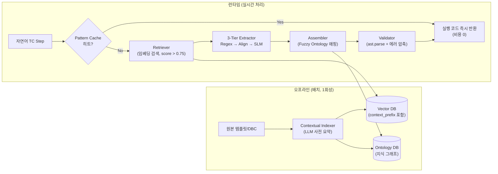

# 04. Contextual RAG 기반 차세대 아키텍처 설계

본 폴더는 `docs/03_advanced_design`에서 제안된 **Direct Synthesis 아키텍처(방안 B)**를 기반으로, 토큰 비용을 최소화하는 **방안 C (Contextual RAG)** 로의 상세 설계 문서들을 담고 있습니다.

---

## 📂 문서 목록

| 문서 | 설명 |
| :--- | :--- |
| [RAG 비용 전략 비교](./rag_cost_optimization_strategy.md) | 현재 구현 / 03 설계 / Contextual RAG — 3가지 아키텍처의 LLM 호출 비용 정량 분석 |
| [아키텍처 설계서](./architecture.md) | 방안 C 전체 시스템 다이어그램 및 모듈별 상세 구현 가이드 |
| [실행 시퀀스](./execution_sequence.md) | Happy Path, 재귀 메타-템플릿, Tier 3 Fallback, Self-Correction, Pattern Cache, No-Code 등록 |
| [프롬프트 엔지니어링 가이드](./prompt_engineering_guide.md) | LLM 4개 호출 지점 프롬프트 상세 (Fuzzy Filter/Error Compressor 반영) |

**`db/` 서브폴더** — DB 설계 문서 및 예시 데이터:

| 파일 | 설명 |
| :--- | :--- |
| [db/vector_db_design.md](./db/vector_db_design.md) | Contextual Indexing 전략, 레코드 스키마, 검색 파이프라인 |
| [db/ontology_db_design.md](./db/ontology_db_design.md) | 지식 그래프 구조, 노드/엣지 스키마, 그래프 순회 알고리즘 |
| [db/vector_db_sample.json](./db/vector_db_sample.json) | Vector DB 예시 데이터 (11개 템플릿, context_prefix 포함) |
| [db/ontology_graph_sample.json](./db/ontology_graph_sample.json) | Ontology DB 예시 데이터 (21개 노드, 36개 엣지, 차종 2개) |

---

## 🏗️ 방안 C 아키텍처 한눈에 보기

---

## 💰 비용 절감 요약 (TC 100건 기준)

| 방안 | 생성형 LLM 토큰 | A 대비 절감율 |
| :--- | ---: | ---: |
| **방안 A** (현재 구현) | 2,310,000 tok | — |
| **방안 B** (03 Direct Synthesis) | 132,000 tok | 94.3% ↓ |
| **방안 C** (Contextual RAG, 본 폴더) | 67,200 tok | **97.1% ↓** |

> 상세 비용 분석 → [00_rag_cost_optimization_strategy.md](./00_rag_cost_optimization_strategy.md)

---

## 🗺️ 03 Advanced Design과의 관계

본 폴더의 설계는 `docs/03_advanced_design`의 설계를 **전제**합니다. 03의 핵심 설계 문서와의 관계는 다음과 같습니다.

| 03 설계 문서 | 본 폴더에서의 역할 |
| :--- | :--- |
| `architecture_design.md` | 방안 B 파이프라인 → 방안 C가 이를 상속하여 보강 |
| `prompt_engineering_guide.md` | Tier 3 Fallback LLM 프롬프트 → 방안 C에서도 동일 적용 |
| `db/vector_db_schema.md` | 기존 스키마 → `context_prefix` 필드를 추가하여 확장 |
| `db/ontology_db_schema.md` | 기존 스키마 → Fuzzy Filter 로직을 추가하여 확장 |
