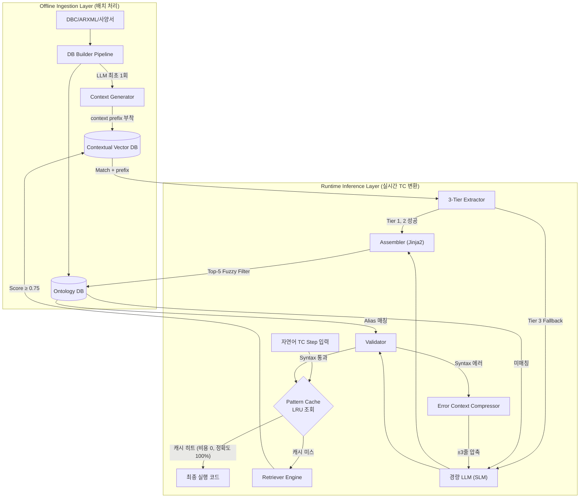

# 차세대 Contextual RAG 아키텍처 상세 설계서 (방안 C 구현 가이드)

본 문서는 `rag_cost_optimization_strategy.md`에서 도출된 최적의 전략인 **방안 C (Contextual RAG 기반 Direct Synthesis)**를 시스템 수준에서 어떻게 구현할 것인지 상세히 정의한 아키텍처 설계서입니다.

03_advanced_design 설계의 **"LLM을 Fallback으로만 쓰는 결정론적 파이프라인(방안 B)"** 을 유지하면서, Vector DB와 Ontology DB 검색 효율을 극한으로 끌어올려 불가피한 LLM(Fallback) 호출 시의 입력 토큰마저 최소화하는 아키텍처의 구체적인 구현 방안을 다룹니다.


---

## 1. 아키텍처 개요 및 핵심 흐름

이 아키텍처의 목표는 **"가장 작은 비용으로 가장 정확한 컨텍스트(Context)를 조립하는 것"**입니다. 전체 흐름은 크게 오프라인 파이프라인(지식 구축)과 런타임 추론 파이프라인(스크립트 생성)으로 나뉩니다.

### 1-1. 전체 시스템 다이어그램



---

## 2. 모듈별 상세 설계 (구현 관점)

> 아래 각 섹션은 §1.1 다이어그램의 노드와 1:1 대응됩니다.

| 다이어그램 노드 | 문서 섹션 | 컴포넌트 파일 |
| :--- | :--- | :--- |
| Pattern Cache | **§4** Pattern Cache Layer 설계 | `src/core/pattern_cache.py` |
| Contextual Indexer (오프라인) | §2.1 | `src/db/context_indexer.py` |
| Retriever Engine | §2.2 | `src/core/retriever.py` |
| Assembler (Jinja2) | §2.3 | `src/core/assembler.py` |
| Ontology Router (Fuzzy Filter) | §2.4 | `src/db/ontology_graph.py` |
| Error Context Compressor | §2.5 | `src/core/validator.py` |

### 2.1. Offline: Contextual Indexer 설계 (DB 구축 레이어)

모든 검색의 정확도는 DB에 들어가는 데이터의 '품질'에 의해 결정됩니다. 단순 텍스트 임베딩을 넘어, **각 시그널과 템플릿의 문맥(Context)을 사전 생성하여 벡터화**합니다.

*   **컴포넌트**: `src/db/context_indexer.py` (신규 생성)
*   **동작 방식**: 
    1.  DBC 파일이나 템플릿 정의 JSON을 읽어들입니다.
    2.  각 템플릿/시그널에 대해 가장 저렴한 모델(gpt-4o-mini 등)을 사용하여 2~3문장의 요약(Context)을 생성합니다.
    3.  `context_prefix` 필드에 요약을 저장하고, 이를 포함한 텍스트로 임베딩을 수행합니다.

**Contextual Indexer 오프라인 배치 스크립트 예시**:
```python
def generate_context_prefix(template_def: dict, llm_client) -> str:
    """오프라인에서 템플릿의 의미와 제약사항을 LLM으로 미리 요약"""
    prompt = f"""
    아래 자동차 제어 템플릿 데이터를 보고 3문장 이내로 요약해라.
    1. 언제 이 액션을 쓰는가?
    2. 연관된 ECU나 물리 파츠는 무엇인가?
    [Data]: {template_def}
    """
    response = llm_client.invoke(prompt)
    return response.content

def build_contextual_index(source_jsons: list):
    for item in source_jsons:
        # LLM 호출은 인덱싱(초기화/업데이트) 시 1회만 발생 (런타임 비용 0)
        item["context_prefix"] = generate_context_prefix(item)
        
        # 임베딩 대상 문자열 = Context + 실제 타겟 소스
        item["vector_source"] = f"{item['context_prefix']}\n\n{item['vector_source']}"
        db.insert(item)
```

### 2.2. Runtime: Retriever Engine 설계

Retriever는 단순히 유사한 항목을 가져오는 것을 넘어, 품질이 낮은 노이즈의 유입을 원천 차단해야 합니다. 

*   **컴포넌트**: `src/core/retriever.py` 
*   **핵심 로직**: `score_threshold` (임계값) 도입
    *   임베딩 모델(예: `all-MiniLM-L6-v2`)의 Cosine Similarity Score 기준, 유사도가 0.75 미만인 매칭 결과는 버립니다.
    *   만약 유효한 템플릿이 0개라면, `Template Rescue` 파이프라인(LLM Fallback)으로 즉시 라우팅합니다.

**Retriever Threshold 구현 예시**:
```python
def retrieve_templates(user_text: str, top_k=3, threshold=0.75):
    results = vector_db.query(user_text, top_k=top_k)
    valid_matches = []
    
    for item in results:
        # 유사도가 기준치 미달이면 노이즈로 간주하고 과감히 버림
        if item.score >= threshold:
            valid_matches.append(item)
            
    if not valid_matches:
        # 유효한 템플릿이 없는 경우 -> Rescue Flow (LLM) 시작
        return TemplateRescueEngine.run(user_text)
        
    return valid_matches
```

### 2.3. Runtime: Assembler (Jinja2) 설계

Retriever에서 매칭된 템플릿과 Extractor(3-Tier)가 추출한 변수, Ontology Router가 확정한 시그널명을 받아 **최종 실행 코드를 조립**합니다. 코드 조립 엔진으로 **Jinja2 템플릿 렌더링**을 사용합니다.

*   **컴포넌트**: `src/core/assembler.py`
*   **동작 방식**:
    1. Vector DB의 `target_code` 필드(Jinja2 템플릿 문자열)를 가져옵니다.
    2. Ontology Router가 확정한 `ecu`, `signal`, `data_type` 등을 변수로 구성합니다.
    3. `jinja2.Environment.from_string(target_code).render(**vars)`로 최종 코드를 생성합니다.
    4. META_CONTROL_*형(IF-ELSE, LOOP)의 경우 하위 Action을 재귀적으로 조립한 후 `| indent(4)` 필터로 들여쓰기를 처리합니다.

> 상세 설계 및 타입별 예시는 [jinja_template_engine.md](../jinja_template_engine.md) 참조.

### 2.4. Runtime: Ontology Router — Fuzzy Filtering 설계

Extractor가 추출한 자연어 시그널명(`"좌측 헤드램프"`)을 Ontology DB의 정확한 신호명(`Left_HeadLamp`)으로 매핑합니다. DB에 정확한 이름이 없을 경우 **TheFuzz(Levenshtein Distance 기반) 라이브러리로 전체 노드 중 Top-5 후보를 먼저 추린 뒤** 소수 후보만 LLM에 전달하여 토큰을 96% 절감합니다.

*   **컴포넌트**: `src/db/ontology_graph.py`
*   **의존 패키지**: `pip install thefuzz python-Levenshtein`

> 상세 설계 (Fuzzy 알고리즘 원리, TheFuzz 스코어링 비교, 구현 코드, 전체 흐름)는 [ontology_router_design.md](ontology_router_design.md) 참조.


### 2.5. Runtime: Error Context Compressor 설계 (Self-Correction Loop)

Validator 검증(ex: `ast.parse` 오류, 정의되지 않은 변수 참조 오류)에 실패하여 Self-Correction Loop를 가동해야 할 경우, 오류가 발생한 지점의 핵심 정보만 LLM에 넘깁니다.

*   **컴포넌트**: `src/core/validator.py`
*   **동작 방식**: 
    1.  Traceback 객체를 분석하여 실제 에러가 발생한 소스코드의 줄 번호(Line Number)를 추적.
    2.  전체 코드 50줄을 보내는 대신, 에러 발생 위치 `[Line-3 : Line+3]` 영역 파씽.
    3.  에러 로그의 끝단(Exception Type과 Message)만 1줄로 요약.

**Error Context Compressor 구현 예시**:
```python
def compress_error_context(code_str: str, error_line_num: int, error_msg: str) -> str:
    lines = code_str.split('\n')
    start_idx = max(0, error_line_num - 1 - 3)
    end_idx = min(len(lines), error_line_num - 1 + 4)
    
    compressed = "[오류 발생 주변 코드 (±3줄)]\n"
    for i in range(start_idx, end_idx):
        marker = ">>>>> " if i == (error_line_num - 1) else "      "
        compressed += f"{marker} L{i+1}: {lines[i]}\n"
        
    compressed += f"\n[핵심 에러 메시지]: {error_msg.split('\n')[-1]}"
    return compressed
```
에러 발생 시 이 `compressed` 텍스트만 Prompt에 추가합니다.

---

## 3. 데이터 및 워크플로우 명세

### 3.1. Vector DB JSON 스키마 (최종)

```json
{
  "id": "action_set_signal",
  "type": "ACTION",
  "context_prefix": "차량 제어 시그널의 상태값을 변경하는 할당 동작...", 
  "vector_source": "차량 제어 시그널의 상태값을 변경하는 할당 동작... {signal}를 {value}로 설정한다",
  "regex_pattern": "^.*?(?P<signal>.+?)(?:을|를)?\\s+(?P<value>.+?)(?:으로|로)?\\s+설정.*$",
  "variables": ["signal", "value"],
  "target_code": "simva.set_signal(signals.{{ ecu }}.{{ signal }}, {{ value | to_python_value(data_type) }})"
}
```
*   **주의**: `target_code`는 **Jinja2 템플릿 문자열**입니다. Retriever가 DB에서 꺼내 Assembler에 전달하면, Assembler가 `env.from_string(target_code).render(**vars)`로 최종 코드를 생성합니다. 임베딩 엔진(ChromaDB)에는 `vector_source` 칼럼을 통째로 넘겨 임베딩하되, 조회 결과로는 `regex_pattern`과 `target_code`만 뽑아 씁니다.

### 3.2. 런타임 변환 시퀀스 (통합 플로우)

1.  **Input**: `"좌측 헤드램프를 상향등으로 켜라"`
2.  **Retriever**: Vector DB 검색
    *   `context_prefix`의 도움으로 `action_set_signal` 템플릿과 매칭 완료 (`Score: 0.89` > `0.75`, 통과)
3.  **Extractor (Tier 1)**: Regex 실행
    *   `(?P<signal>좌측 헤드램프)`
    *   `(?P<value>상향등)`
    *   (성공. LLM 미사용, 비용 0)
4.  **Assembler (Ontology)**: Mapping
    *   `"좌측 헤드램프"` → Graph에 정확한 이름 없음 → **Fuzzy Filter → Ontology Router LLM 호출** 가동
    *   Fuzzy Filter: 전체 350개 노드 중 `[Left_HeadLamp, Right_HeadLamp, FogLamp, ...]` Top-5 추출 (비용 0)
    *   Ontology Router LLM: `"후보 5개 중 '좌측 헤드램프'는? → Left_HeadLamp"` (~80 tok)
5.  **Assembler (Jinja2 렌더링)**: 추출된 변수로 템플릿 렌더링
    *   `env.from_string("simva.set_signal(signals.{{ ecu }}.{{ signal }}, {{ value | to_python_value(data_type) }})")`
    *   `.render(ecu="BCM", signal="Left_HeadLamp", value="HIGH", data_type="string")`
    *   결과: `simva.set_signal(signals.BCM.Left_HeadLamp, "HIGH")`
        *(※ `"상향등"` 역시 Ontology를 거쳐 `"HIGH"`로 변환됨)*
6.  **Validator**:
    *   ast.parse() 검사 (정상). Self-Correction 미호출 (비용 0)
7.  **Output 발행**

---

## 4. Pattern Cache Layer 설계

> [!NOTE]
> Pattern Cache는 "확장 예정 기능"이 아닌, **방안 C 아키텍처의 핵심 레이어**입니다. Retriever 호출 전 최우선으로 동작하며, 정확도와 처리 속도를 함께 보장합니다.

Pattern Cache는 단순한 비용 절감 수단이 아닙니다. **정확도·일관성·속도를 동시에 보장하는 메커니즘**입니다.

| 관점 | 효과 |
| :--- | :--- |
| **정확도** | 이미 Validator 통과한 코드 재사용 → 환각 리스크 없음 |
| **일관성** | 동일 입력 → 항상 동일 출력 (비결정적 LLM 우회) |
| **비용·속도** | Retriever~Validator 전 단계 생략, ms 단위 응답 |

핵심 설계 구성:
- **키**: 조사·공백 정규화 → SHA256 해시 + 차종(variant) 포함
- **값**: Jinja2 렌더링 완료 + Validator 통과된 `CacheEntry`
- **교체**: LRU (MAX_SIZE=1,000)
- **무효화**: 템플릿 수정 시 `template_id` 기준 일괄 삭제
- **자가 학습**: LLM Fallback 결과도 캐시에 저장 → 장기적으로 Fallback 빈도 감소

> 상세 설계 (키 전략, 값 구조, LRU 구현, 무효화, 자가 학습 루프)는 [pattern_cache_design.md](pattern_cache_design.md) 참조.

---

## 5. 결론 및 다음 단계

위 아키텍처는 이론상 TC 문장의 90% 이상을 **로컬 연산 자원만으로 밀리초(ms) 단위 처리**하며, 불가피한 10%의 예외 케이스 처리 시에도 기존 Full Context 방식 대비 **약 30~40% 수준의 API 토큰만 요구**하는 시스템입니다.

**구현 우선순위 (Action Item)**:
1.  `rag_cost_optimization_strategy.md`에 명시된 Vector DB 스키마 업데이트 (`context_prefix` 등) 보강 작업.
2.  `src/core/retriever.py` 내 `score_threshold` (0.75 초안) 도입 및 노이즈 필터링 검증.
3.  Ontology 모듈 내 `TheFuzz` 기반 Fuzzy 사전 필터링 로직 도입. → [ontology_router_design.md](ontology_router_design.md)
4.  Validator 내 에러 컴프레서(Error Context Compressor) 모듈 추가 구현.
5.  `src/core/pattern_cache.py` 구현. → [pattern_cache_design.md](pattern_cache_design.md)


| 관점 | 효과 | 근거 |
| :--- | :--- | :--- |
| **비용** | Retriever~Validator 전 단계 호출 0 | 캐시 히트 시 임베딩 연산, LLM 호출 없음 |
| **정확도** | **이미 검증 완료된 코드를 그대로 반환** | LLM Fallback으로 인한 새로운 환각 리스크 없음 |
| **일관성** | 동일 입력 → 항상 동일 출력 | 비결정적 LLM을 우회하므로 100% 재현 가능 |
| **응답 속도** | ms 단위 응답 | DB 검색과 LLM 호출 전 단계 생략 |

> LLM은 같은 입력에도 매번 다른 출력을 낼 수 있습니다. Pattern Cache를 먼저 조회하면, **"이미 사람이 검증하거나 Validator가 통과시킨 코드"**를 재사용하므로 정확도가 구조적으로 보장됩니다.

---

