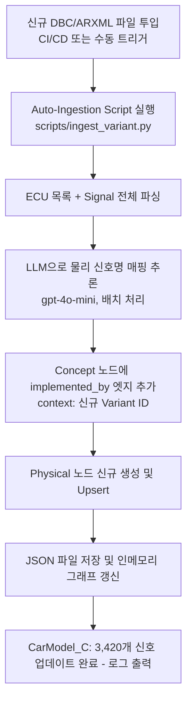
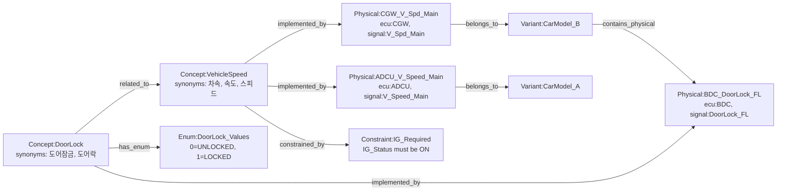

# Contextual RAG — Ontology DB 상세 설계서

본 문서는 방안 C (Contextual RAG) 아키텍처에서 사용되는 **Ontology DB의 지식 그래프 구조, 노드/엣지 스키마, 검색 전략, 자동 갱신 파이프라인**을 상세히 정의합니다.

> 참조: [01_architecture.md](./01_architecture.md) §2.3 Ontology Router의 Fuzzy Filtering 설계

---

## 1. 역할 및 설계 원칙

Ontology DB는 이 아키텍처에서 **"단어와 번역을 담당하는 통역관"** 역할을 수행합니다.

| 역할 | 설명 |
| :--- | :--- |
| **시그널 번역 (Signal Translation)** | `"차량 속도"`, `"악셀"` 같은 자연어/현장 은어를 물리 시그널 ID로 변환 |
| **차종 매핑 (Variant Routing)** | 같은 `"차량 속도"`라도 차종(Variant)별로 대응하는 물리 신호가 다를 수 있음 |
| **값 정규화 (Value Normalization)** | `"켜기"`, `"ON"`, `"1"` → DBC/ARXML 기준의 공식 값으로 정규화 |
| **제약 조건 검증 (Constraint Check)** | 시그널 조작 전 선행 조건(Pre-condition) 정보 반환 |

### 핵심 설계 원칙

> [!IMPORTANT]
> **단일 지식 그래프(Single Knowledge Graph)** 방식을 채택합니다. 여러 파일로 분산 관리 시 도메인 전체의 관계망 파악이 어렵고 차종이 추가될 때마다 파일이 폭증합니다. 하나의 JSON 파일로 모든 개념·물리신호·차종·값을 노드-엣지 형태로 통합 관리합니다.

---

## 2. 지식 그래프 노드(Node) 종류

Ontology Graph의 모든 정보는 독립적인 **노드(Node)** 단위로 표현됩니다.

| 노드 접두사 | 설명 | 관리 주체 |
| :--- | :--- | :--- |
| `Concept:*` | 논리적 개념 노드 (예: `Concept:VehicleSpeed`) | 도메인 엔지니어 |
| `Physical:*` | 특정 차종의 물리 시그널 노드 (예: `Physical:ADCU_V_Speed`) | DBC/ARXML 자동 파싱 |
| `Variant:*` | 차종 노드 (예: `Variant:CarModel_B`) | 시스템 관리자 |
| `Enum:*` | 열거형 값 정의 노드 (예: `Enum:DoorLock_Values`) | 도메인 엔지니어 |
| `Constraint:*` | 선행 조건 노드 (예: `Constraint:IG_Required`) | 도메인 엔지니어 |

---

## 3. 노드 스키마 상세

### 3.1. Concept 노드 (논리적 개념)

```json
{
  "id": "Concept:VehicleSpeed",
  "node_type": "concept",
  "label": "차량 속도",
  "description": "차량의 현재 주행 속도를 나타내는 논리적 신호. 안전 기능, 도어 잠금 등 다양한 제어 로직에서 참조됨.",
  "synonyms": ["차속", "속도", "스피드", "vehicle speed", "v_speed", "현재속도", "주행속도"],
  "unit": "km/h",
  "data_type": "float32",
  "value_range": { "min": 0, "max": 300 },
  "enum_ref": null,
  "relationships": [
    { "relation": "implemented_by", "target": "Physical:ADCU_V_Speed_Main", "context": "Variant:CarModel_A" },
    { "relation": "implemented_by", "target": "Physical:CGW_V_Spd_Main",    "context": "Variant:CarModel_B" },
    { "relation": "constrained_by", "target": "Constraint:IG_Required" },
    { "relation": "related_to",     "target": "Concept:GearStatus",          "description": "기어 상태와 상호 연동" }
  ]
}
```

### 3.2. Physical 노드 (물리 시그널)

```json
{
  "id": "Physical:CGW_V_Spd_Main",
  "node_type": "physical",
  "label": "CGW_V_Spd_Main",
  "ecu": "CGW",
  "signal_id": "V_Spd_Main",
  "dbc_message_id": "0x123",
  "data_type": "uint16",
  "unit": "km/h",
  "scaling": { "factor": 0.01, "offset": 0 },
  "relationships": [
    { "relation": "represents", "target": "Concept:VehicleSpeed" },
    { "relation": "belongs_to",  "target": "Variant:CarModel_B" }
  ]
}
```

### 3.3. Variant 노드 (차종)

```json
{
  "id": "Variant:CarModel_B",
  "node_type": "variant",
  "label": "Car Model B",
  "description": "2024년형 차량 B 모델 (전기차 기반)",
  "relationships": [
    { "relation": "contains_physical", "target": "Physical:CGW_V_Spd_Main" },
    { "relation": "contains_physical", "target": "Physical:BDC_DoorLock_FL" }
  ]
}
```

### 3.4. Enum 노드 (값 정의)

```json
{
  "id": "Enum:DoorLock_Values",
  "node_type": "enum",
  "label": "도어 잠금 상태 열거형",
  "concept_ref": "Concept:DoorLock",
  "values": [
    { "raw": 0,    "official": "UNLOCKED", "synonyms": ["열림", "해제", "unlock", "열려있음"] },
    { "raw": 1,    "official": "LOCKED",   "synonyms": ["잠김", "잠금", "lock", "잠겨있음"] },
    { "raw": 2,    "official": "AJAR",     "synonyms": ["열린채로", "미완전잠금", "ajar"] }
  ]
}
```

### 3.5. Constraint 노드 (선행 조건)

```json
{
  "id": "Constraint:IG_Required",
  "node_type": "constraint",
  "label": "IG ON 선행 조건",
  "description": "이 시그널을 조작하기 전에 IG(Ignition)가 ON 상태이어야 합니다.",
  "check_signal":     "Concept:IG_Status",
  "required_value":   "ON",
  "severity":         "WARNING",
  "relationships": []
}
```

---

## 4. 엣지(Relationship) 종류 정의

| 관계명 | 방향 | 의미 |
| :--- | :--- | :--- |
| `implemented_by` | Concept → Physical | 논리 개념이 특정 차종의 물리 신호로 구현됨 |
| `represents` | Physical → Concept | 물리 신호가 나타내는 논리 개념 |
| `belongs_to` | Physical → Variant | 물리 신호가 속한 차종 |
| `contains_physical` | Variant → Physical | 차종이 보유하는 물리 신호 목록 |
| `constrained_by` | Concept → Constraint | 조작 시 선행 조건 필요 |
| `has_enum` | Concept → Enum | 해당 개념의 허용 값 열거형 |
| `related_to` | Concept ↔ Concept | 로직이 연관된 다른 개념 |
| `depends_on` | Concept → Concept | 이 개념의 동작이 다른 개념에 의존 |

---

## 5. 그래프 순회(Traversal) 알고리즘

### 5.1. 기본 매핑 흐름 (Concept → Physical)

```
입력: 자연어 신호명 = "차량 속도", 대상 차종 = Variant:CarModel_B

Step 1. Fuzzy 사전 필터링 (TheFuzz)
        → synonyms 풀에서 "차량 속도"와 유사한 상위 5개 Concept 노드 추출
        → [Concept:VehicleSpeed (score:94), Concept:TargetSpeed (score:72), ...]

Step 2. 최고 점수 Concept 선택
        → Concept:VehicleSpeed 확정

Step 3. implemented_by 엣지 순회 (Variant 컨텍스트 필터)
        → Concept:VehicleSpeed.relationships 탐색
        → context == "Variant:CarModel_B" 인 엣지 선택
        → 대상: Physical:CGW_V_Spd_Main

Step 4. Physical 노드에서 ecu, signal_id 추출
        → ecu = "CGW", signal_id = "V_Spd_Main"

최종 반환: { "ecu": "CGW", "signal_id": "V_Spd_Main", "data_type": "uint16" }
```

### 5.2. Enum 값 정규화 흐름

```
입력: 추출된 값 = "켜기", 대상 시그널 = Concept:IG_Status

Step 1. Concept 노드의 has_enum 엣지 탐색
        → Enum:IG_Values 노드 도달

Step 2. Enum 노드의 values 배열에서 synonyms 매칭
        → "켜기" → synonyms 검색 → raw=1, official="ON" 매칭

Step 3. 데이터 타입 캐스팅
        → data_type: boolean → True

최종 반환: { "official": "ON", "raw": 1, "python_value": "True" }
```

### 5.3. Fuzzy 1차 필터링 + LLM 2차 보완 흐름

```
                 [미매칭 은어 입력]
                       │
         ┌─────────────┴────────────┐
         ▼                          ▼
   Fuzzy 필터 점수 ≥ 80         Fuzzy 필터 점수 < 80
   (자신있음, LLM 불필요)        (불확실, LLM 보완)
         │                          │
         ▼                          ▼
   즉시 Concept 확정           Top-5 후보만 LLM에 전달
   (비용 0)                    (소량 토큰, 약 300 tok)
                                    │
                                    ▼
                              LLM이 최적 Concept 선택
```

---

## 6. 자동 갱신 파이프라인 (Auto-Ingestion)

### 6.1. 새 차종(Variant) 추가 시



### 6.2. 수동 Alias 추가 (테스트 엔지니어가 현장 은어 등록)

1. Management UI에서 현장 은어 입력 (`"악셀"`)
2. 시스템이 Fuzzy 검색으로 후보 Concept 추천 (`"Concept:AccelPedal"`)
3. 테스트 엔지니어가 확인 후 확정
4. 해당 Concept 노드의 `synonyms` 배열에 즉시 추가
5. Approval Queue가 없는 단순 Alias 등록은 자동 반영 (핫 리로드)

---

## 7. 파일 저장 및 관리 전략

### 7.1. 저장 형식

Ontology DB는 단일 JSON 파일(`ontology_graph.json`) + 인메모리 NetworkX 그래프의 2-Layer 구조로 관리합니다.

```
data/
└── ontology_graph.json    ← 단일 진실의 원천 (Source of Truth), Git 관리 대상
    ├── nodes[]            ← 모든 노드 배열 (Concept, Physical, Variant, Enum, Constraint)
    └── edges[]            ← 모든 엣지 배열 (relations between nodes)
```

런타임에는 이 JSON을 `NetworkX DiGraph`로 로드하여 고속 탐색을 수행합니다.

### 7.2. 규모 증가 시 마이그레이션 경로

| 시그널 규모 | 권장 저장소 | 탐색 방식 |
| :--- | :--- | :--- |
| ~500개 | JSON 파일 + NetworkX (현재 전략) | Python 인메모리 탐색 |
| ~5,000개 | JSON + NetworkX 유지, 인덱스 추가 | 캐시 레이어 도입 |
| 5,000개 이상 | **Neo4j** 또는 **ArangoDB** 마이그레이션 | Cypher/AQL 쿼리 |

> [!TIP]
> JSON + NetworkX 전략은 설치가 불필요하고 Git으로 버전 관리가 가능하여 초기 단계의 생산성이 매우 높습니다. 시그널 종류가 5,000개를 넘어가는 시점에 Neo4j 전환을 검토합니다.

---

## 8. 전체 노드 관계 다이어그램 (예시)


