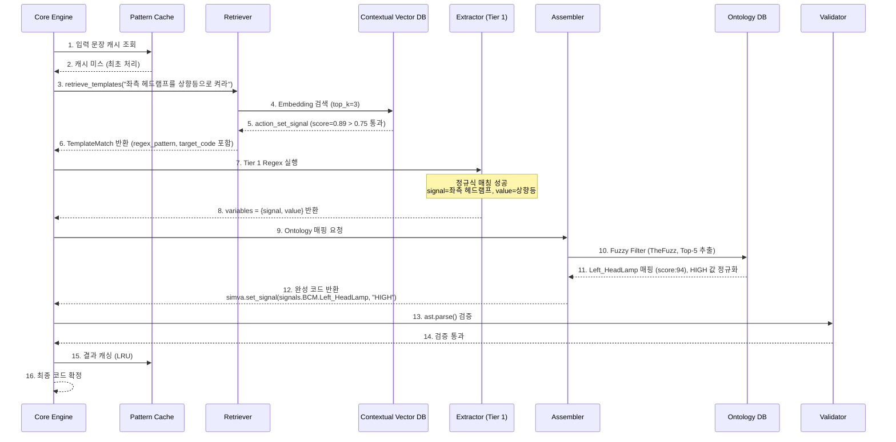
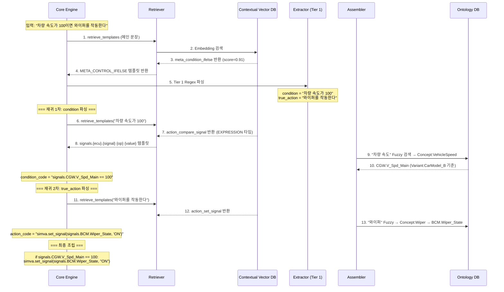
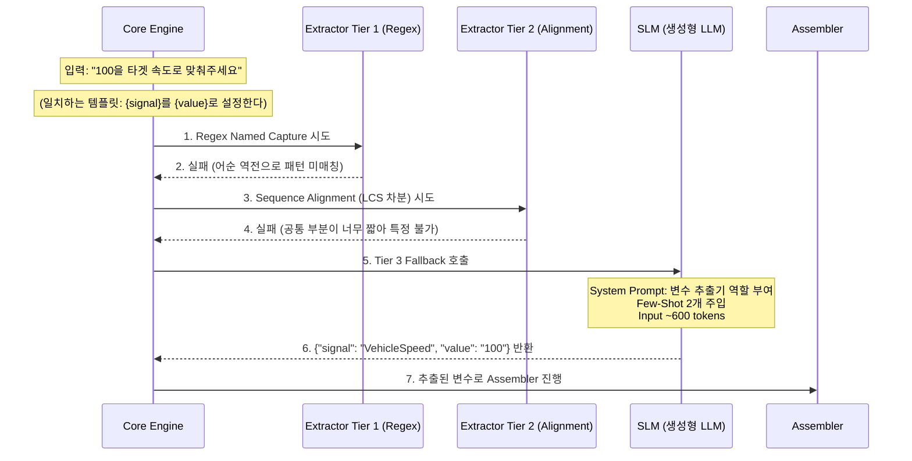
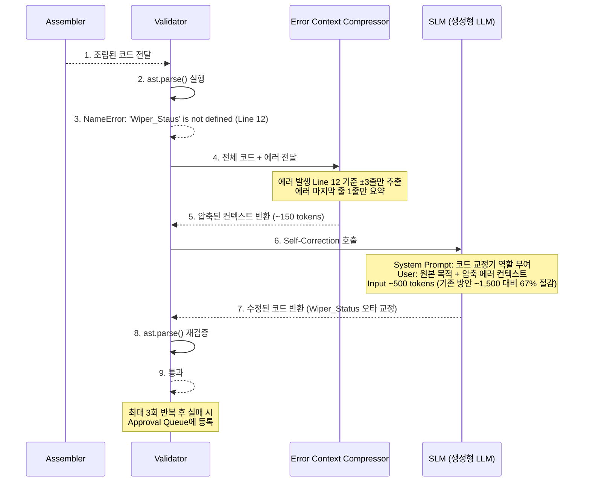
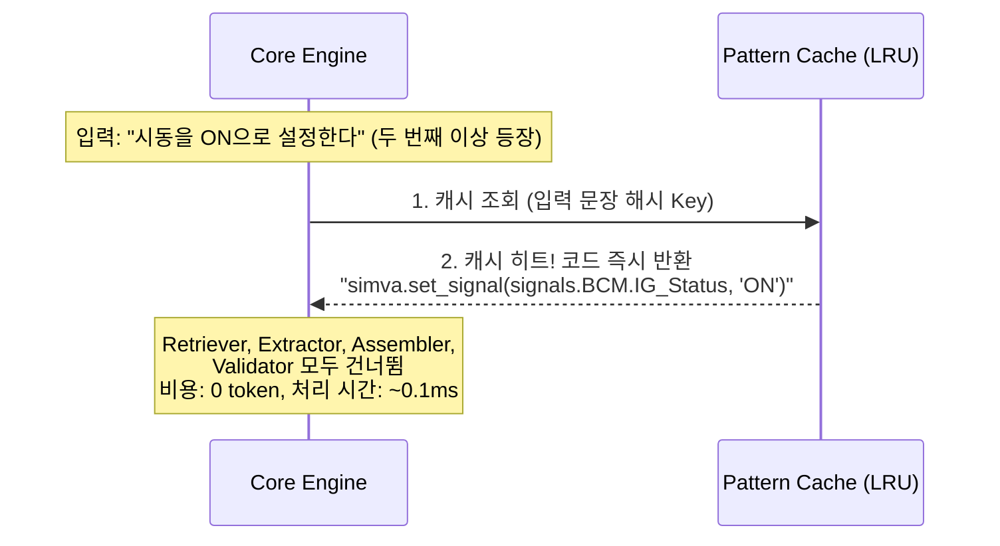
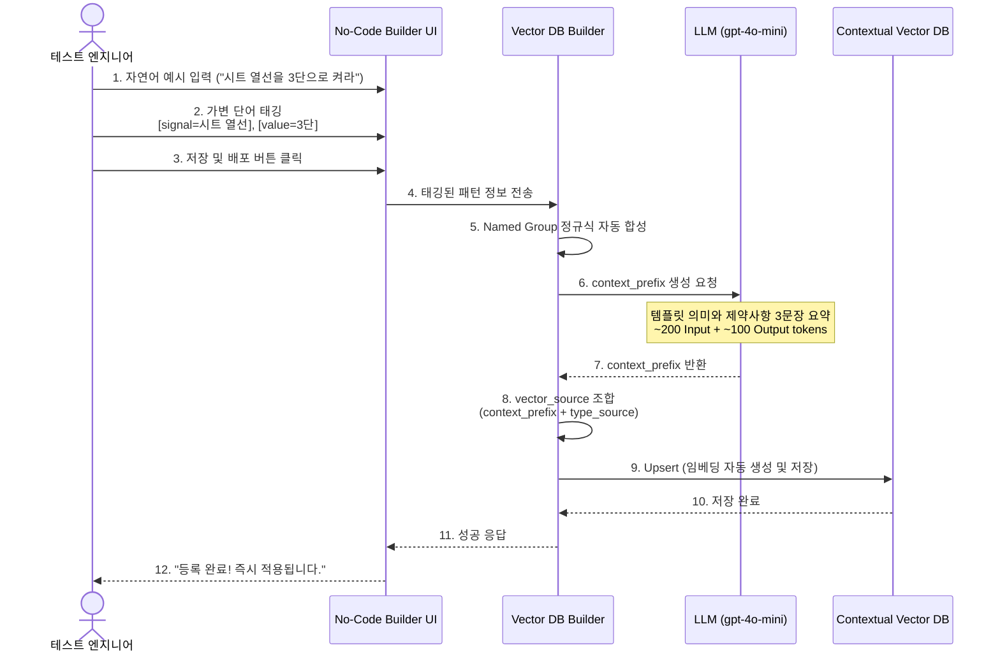

# Contextual RAG — 실행 시퀀스 설계서 (방안 C)

본 문서는 방안 C (Contextual RAG 기반 Direct Synthesis) 아키텍처의 **실제 런타임 실행 흐름**을 시퀀스 다이어그램과 함께 상세히 설명합니다. 방안 B(`docs/03_advanced_design/execution_sequence.md`)와 달리 **Pattern Cache**, **Contextual Vector DB**, **Fuzzy Filter**, **Error Compressor** 모듈이 추가된 흐름입니다.

---

## 1. 핵심 변환 시퀀스 — 단순 Action 문장 (Happy Path)

가장 빈번한 케이스인 **Tier 1 (Regex) 성공 경로**입니다. 생성형 LLM을 전혀 사용하지 않습니다.

**비용**: Embedding 호출 1회 + 모든 나머지 처리 로컬 (생성형 LLM 0회)

---

## 2. 핵심 변환 시퀀스 — 복합 조건문 (재귀적 메타-템플릿)

`"차량 속도가 100이면 와이퍼를 작동한다"` 같은 조건문의 재귀 파싱 흐름입니다.

---

## 3. Fallback 시퀀스 — Tier 3 SLM 변수 추출

Tier 1 (Regex), Tier 2 (Alignment)가 모두 실패하여 **생성형 LLM을 사용하는 경로**입니다.

**비용**: 생성형 LLM 1회 (~600 Input + ~50 Output tokens)

---

## 4. Self-Correction 시퀀스 — Error Compressor 활용

Validator가 Syntax 오류를 감지했을 때 **에러 압축 후 LLM 재호출**하는 흐름입니다.

---

## 5. Pattern Cache 히트 시퀀스 (비용 제로)

동일 문장이 반복 등장할 때 **모든 파이프라인을 건너뛰는** 흐름입니다.

---

## 6. Vector DB 유지보수 시퀀스 — No-Code 템플릿 등록

테스트 엔지니어가 관리 UI에서 새 패턴을 직접 등록하는 흐름입니다.

---

## 7. 방안 B vs 방안 C 시퀀스 비교

| 시퀀스 단계 | 방안 B (03 설계) | 방안 C (04 설계, 추가된 모듈) |
| :--- | :--- | :--- |
| **캐시 조회** | 없음 | ✅ Pattern Cache (LRU) 선행 조회 |
| **Vector DB 검색** | 일반 임베딩 검색 | ✅ context_prefix 포함 Contextual 검색 |
| **Score 필터** | 없음 (모든 결과 사용) | ✅ score_threshold=0.75 노이즈 차단 |
| **Ontology 매핑** | 전체 노드 LLM 전달 | ✅ Fuzzy Top-5 사전 필터링 후 소량만 전달 |
| **에러 처리** | 전체 코드 + 전체 Traceback | ✅ Error Compressor: ±3줄 + 요약 1줄만 |
| **DB 등록** | 수동 JSON 편집 | ✅ No-Code Builder UI + LLM context_prefix 자동 생성 |
