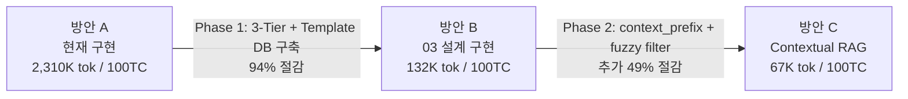
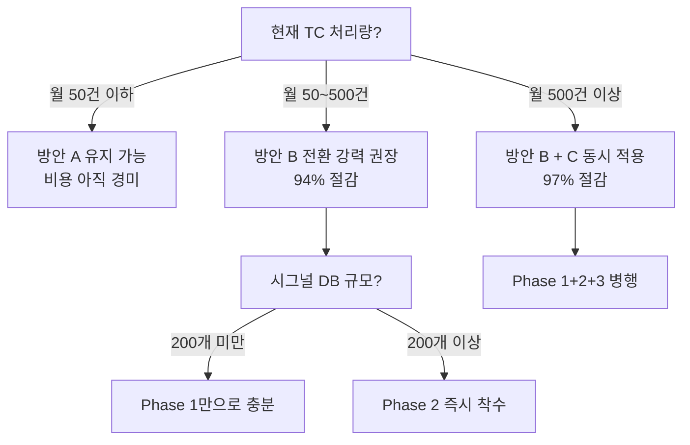

# RAG 기반 토큰 비용 최적화 전략 — 3가지 아키텍처 비교 분석

본 문서는 TestScriptGenerator의 LLM 활용 방식을 **3가지 아키텍처**로 나누어 비교합니다. 각 방안의 LLM 호출 지점, 토큰 구조, 비용을 정량 분석한 뒤 최적 절감 전략을 도출합니다.

---

## 📖 사전 지식: Embedding Model vs 생성형 LLM — 무엇이 다른가?

본 문서에서 사용하는 "모델 호출"에는 성격이 전혀 다른 두 가지 종류가 있습니다. 각 방안의 비용 구조를 이해하기 위한 핵심 개념입니다.

### 역할과 동작 방식 비교

| 구분 | Embedding Model (⚡) | 생성형 LLM (🔴) |
| :--- | :--- | :--- |
| **역할** | 텍스트 → 숫자 벡터로 변환 (의미 인코딩) | 텍스트 → 텍스트 생성 (추론 및 합성) |
| **처리 방식** | 입력 문장을 고정 길이 벡터로 압축 | 입력을 읽고 다음 토큰을 순차적으로 예측 |
| **Output** | 숫자 배열 (예: [0.12, -0.34, ...]) | 가변 길이 자연어 텍스트 |
| **Output 토큰** | **없음 (0 token)** | 발생 (가격의 핵심 변수) |
| **모델 예시** | `all-MiniLM-L6-v2`, `text-embedding-3-small` | GPT-4o, Claude 3, Llama 3 8B |
| **API 가격 (Input 1M tok)** | $0.02 ~ 0.13 | $2 ~ $15 |
| **상대적 비용** | **기준 (1x)** | **100~750배 비쌈** |
| **처리 속도** | 수 밀리초 (ms) | 수백 ms ~ 수 초 |
| **사용 목적** | Vector DB 검색, 의미 유사도 비교 | 변수 추출, 코드 생성, 자가 수정 |

### 본 시스템에서의 역할 분리

```
[자연어 TC Step 입력]
        │
        ▼
┌────────────────────────────────────────────────────────────────┐
│  ⚡ Embedding Model (항상 사용, 저비용)                         │
│  • 역할: TC 문장의 '의미'를 vector로 변환하여 DB에서 유사한     │
│          코드 템플릿을 검색 (=Vector DB 검색의 핵심)             │
│  • 비용: Input 토큰만 과금, Output 토큰 없음                     │
└────────────────────────────────────────────────────────────────┘
        │ 검색 성공 (Top-k 결과 반환)
        ▼
┌────────────────────────────────────────────────────────────────┐
│  🔴 생성형 LLM (실패 시에만 사용, 고비용)                       │
│  • 역할: Regex/Graph 등 결정론적 방법이 실패했을 때만 호출      │
│          (Fallback: 변수 추출, Alias 매핑, 코드 수정 등)         │
│  • 비용: Input + Output 토큰 양쪽 과금                           │
└────────────────────────────────────────────────────────────────┘
```

> [!NOTE]
> 본 문서에서 "토큰 비용 절감"이란 **생성형 LLM(🔴)의 호출 횟수와 Input/Output 토큰을 줄이는 것**을 의미합니다. Embedding Model(⚡)의 비용은 어떤 방안에서도 동일하게 발생하며, 금액이 매우 적어 비교 대상에서 제외합니다.

---

## 1. 3가지 아키텍처 한눈에 보기

| 구분 | 방안 A: 현재 구현 | 방안 B: 03 설계 (Direct Synthesis) | 방안 C: Contextual RAG |
| :--- | :--- | :--- | :--- |
| **설계 문서** | 현재 `src/` 구현 코드 | `docs/03_advanced_design/` | 방안 B + Contextual 보강 |
| **핵심 전략** | 매 Step 전부 생성형 LLM 호출 | 3-Tier 추출 → LLM은 Fallback만 | B + 검색 정확도 극대화로 Fallback↓ |
| **시그널 매핑** | LLM이 JSON 한 번에 생성 | Regex → Alignment → (SLM) | B + Vector DB에 맥락 prefix 추가 |
| **코드 생성** | LLM이 IR JSON 직접 생성 | 템플릿 Slotting (조립) | B와 동일 |
| **온톨로지** | 전체 규칙 CONTEXT 주입 | Graph Traversal (코드) | B + fuzzy Top-5 사전 필터링 |

---

## 2. 방안별 LLM 호출 지점 맵

### 방안 A: 현재 구현 (Every-Step LLM)

현재 `engine.py`의 `_process_step_with_retry()`는 **매 Step마다 반드시 생성형 LLM을 호출**합니다.

```
자연어 TC Step (engine.py L63~)
    │
    ├── ① Embedding 검색 (rag_engine.py search_signals) ── Embedding Model ⚡
    │     └ ChromaDB all-MiniLM-L6-v2 (경량, 저비용)
    │
    ├── ② CONTEXT 조립 (prompt_builder.py build_prompt) ── 순수 문자열 조립
    │     ├ Vector DB 매칭 시그널 전체 (top_k=5개) 주입
    │     └ Ontology 규칙 전체 주입
    │
    ├── ③ 🔴 생성형 LLM 호출 (engine.py L171) ────── 매 Step 필수 호출
    │     └ System Prompt (1,500 tok) + CONTEXT + Instruction + Step Text
    │
    └── ④ 🔴 Self-Correction (engine.py L164~) ────── Pydantic 실패 시 재호출 (최대 3회)
          └ 전체 프롬프트 재전송 + 에러 메시지 추가
```

**핵심 특성**: Step 1개 = 생성형 LLM 1~3회 호출 (100% 호출률)

---

### 방안 B: 03 설계 — Direct Synthesis (architecture_design.md 기준)

`architecture_design.md`의 Retriever → Extractor → Assembler → Validator 파이프라인.

```
자연어 TC Step
    │
    ├── ① Retriever (Vector DB 검색) ────────── Embedding Model ⚡
    │     └ 유사 템플릿 + regex_pattern + target_code 반환
    │
    ├── ② Extractor (변수 추출) ─── 3-Tier 계층 구조
    │     ├ Tier 1: Regex Named Capture ────── 모델 미사용 (순수 정규식) ✅
    │     ├ Tier 2: Sequence Alignment ─────── 모델 미사용 (문자열 알고리즘) ✅
    │     └ Tier 3: SLM Fallback ───────────── 🔴 생성형 LLM 호출 (~10% 빈도)
    │                                           (prompt_engineering_guide §2-1)
    │
    ├── ③ Assembler (Ontology 라우팅)
    │     ├ Graph Traversal ────────────────── 모델 미사용 (그래프 순회) ✅
    │     └ Alias 미매칭 시 ────────────────── 🔴 생성형 LLM 호출 (~5% 빈도)
    │                                           (prompt_engineering_guide §2-2)
    │
    ├── ④ Validator (코드 검증)
    │     ├ ast.parse() 정적 분석 ──────────── 모델 미사용 (구문 분석기) ✅
    │     └ Self-Correction ────────────────── 🔴 생성형 LLM 호출 (~15% 빈도)
    │                                           (prompt_engineering_guide §2-3)
    │
    └── ⑤ Template Rescue (미등록 패턴)
          └ Vector DB Score < 0.6 시 ────────── 🔴 생성형 LLM 호출 (~3% 빈도)
                                                (prompt_engineering_guide §2-4)
```

**핵심 특성**: Step 1개 = 생성형 LLM **0~1회** (평균 ~0.2회, 약 80~90% Step은 LLM 없이 처리)

---

### 방안 C: Contextual RAG (방안 B + 맥락 인덱싱 보강)

방안 B의 파이프라인은 동일하되, 각 모듈의 **정확도를 높여** Fallback 빈도를 추가 절감합니다.

```
자연어 TC Step
    │
    ├── ① Retriever (Contextual Vector DB) ── Embedding Model ⚡
    │     └ context_prefix 포함 임베딩 → 매칭 정확도 ↑ → Tier 3 빈도 ↓
    │
    ├── ② Extractor (3-Tier, 동일)
    │     ├ Tier 1: Regex ─────────── ✅
    │     ├ Tier 2: Alignment ─────── ✅
    │     └ Tier 3: SLM Fallback ──── 🔴 (~5% 빈도, B의 10%에서 절반 감소)
    │
    ├── ③ Assembler (Precision Ontology)
    │     ├ Graph Traversal ────────── ✅
    │     ├ fuzzy Top-5 사전 필터링 ── 모델 미사용 (문자열 유사도 알고리즘) ✅
    │     └ Alias 미매칭 시 ────────── 🔴 (~3% 빈도, B의 5%에서 감소)
    │         └ 후보 Top-5만 전송 → 토큰 62% 절감
    │
    ├── ④ Validator (에러 컨텍스트 압축)
    │     ├ ast.parse() ────────────── ✅
    │     └ Self-Correction ────────── 🔴 (~10% 빈도)
    │         └ 에러 주변 ±3줄만 발췌 → 토큰 67% 절감
    │
    └── ⑤ Template Rescue ──────────── 🔴 (~2% 빈도)
```

**핵심 특성**: Step 1개 = 생성형 LLM **0~1회** (평균 ~0.12회, 약 88~95% Step은 LLM 없이 처리)

---

## 3. Step 1건당 토큰 비용 상세 비교

### 3.1 프롬프트 구성별 토큰 내역

| 프롬프트 구성 요소 | 방안 A (현재 구현) | 방안 B (03 설계) | 방안 C (Contextual RAG) |
| :--- | ---: | ---: | ---: |
| **System Prompt** | 1,500 tok (12 Rules 포함) | 해당 없음 (Tier 1/2) | 해당 없음 (Tier 1/2) |
| **CONTEXT 시그널** | 500~2,000 tok (top_k=5) | 해당 없음 (Regex 추출) | 해당 없음 (Regex 추출) |
| **CONTEXT 온톨로지** | 300~1,000 tok (전체 규칙) | 해당 없음 (Graph 순회) | 해당 없음 (Graph 순회) |
| **Instruction/Few-shot** | 500~800 tok | 해당 없음 | 해당 없음 |
| **Step Text** | 30~100 tok | 30~100 tok | 30~100 tok |
| **LLM Output (IR JSON)** | 100~500 tok | 해당 없음 (템플릿 조립) | 해당 없음 (템플릿 조립) |
| ─ | ─ | ─ | ─ |
| **Tier 1/2 경로 (비 LLM)** | — | **0 tok** | **0 tok** |
| **Tier 3 Fallback 시** | — | ~600 tok / 호출 | ~600 tok / 호출 |
| **Ontology Router 시** | — | ~800 tok / 호출 | ~300 tok / 호출 |
| **Self-Correction 시** | — | ~1,500 tok / 호출 | ~500 tok / 호출 |

### 3.2 Step 1건 평균 토큰 비용 (가중 평균)

| | 방안 A | 방안 B | 방안 C |
| :--- | ---: | ---: | ---: |
| **LLM 호출 확률** | 100% | ~20% | ~12% |
| **호출 시 평균 Input 토큰** | 3,500 tok | 800 tok | 470 tok |
| **호출 시 평균 Output 토큰** | 300 tok | 50 tok | 50 tok |
| ─── | ─── | ─── | ─── |
| **Step당 기대 LLM 토큰** | **3,800 tok** | **170 tok** | **62 tok** |

---

## 4. TC 규모별 비용 시뮬레이션

### TC 1건 = 6 Step (5 Action + 1 Expected Result) 기준

| 항목 | 방안 A | 방안 B | 방안 C |
| :--- | ---: | ---: | ---: |
| 생성형 LLM 호출 횟수 | **6~18회** | **~1.2회** | **~0.72회** |
| 총 LLM 토큰 (Input+Output) | **22,800 tok** | **1,020 tok** | **372 tok** |
| Embedding 호출 | 6회 (~300 tok) | 6회 (~300 tok) | 6회 (~300 tok) |

### TC 100건 일괄 처리 시

| 항목 | 방안 A | 방안 B | 방안 C | 비고 |
| :--- | ---: | ---: | ---: | :--- |
| 생성형 LLM 토큰 | **2,280,000** | **102,000** | **37,200** | |
| Embedding 토큰 | 30,000 | 30,000 | 30,000 | 동일 |
| **총 토큰** | **2,310,000** | **132,000** | **67,200** | |
| **A 대비 절감율** | — | **94.3% ↓** | **97.1% ↓** | |
| **B 대비 절감율** | — | — | **49.1% ↓** | |

> [!IMPORTANT]
> 방안 A → B 전환 시 **94% 절감**이라는 압도적인 효과는 "매 Step LLM 호출"에서 "3-Tier Extractor로 90%를 결정론적으로 처리"하는 설계 전환 자체에서 비롯됩니다. 방안 C는 B 위에서 **나머지 10% Fallback 경로를 정밀 최적화**하는 보완 전략입니다.

---

## 5. 방안별 장단점 종합 비교

| 평가 항목 | 방안 A (현재 구현) | 방안 B (03 설계) | 방안 C (Contextual RAG) |
| :--- | :---: | :---: | :---: |
| **토큰 비용** | ❌ 매우 높음 | ✅ 매우 낮음 | ✅✅ 최저 |
| **구현 복잡도** | ✅ 단순 (LLM에 위임) | ⚠️ 중간 (3-Tier + Graph) | ⚠️ 높음 (인덱싱 파이프라인 추가) |
| **미등록 패턴 대응** | ✅ 우수 (LLM 유연성) | ⚠️ Template Rescue 필요 | ✅ 양호 (맥락 임베딩으로 매칭↑) |
| **복합 문장 처리** | ⚠️ LLM 의존 (환각 위험) | ✅ 재귀 메타-템플릿 | ✅ 동일 + 정확도 보강 |
| **확장성 (시그널 증가)** | ❌ 토큰 선형 증가 | ✅ DB 추가만으로 확장 | ✅✅ 검색 정확도까지 확보 |
| **초기 도입 비용** | ✅ 없음 (현행) | ⚠️ 설계 구현 필요 | ⚠️ B + 인덱싱 배치 구축 |
| **응답 속도** | ❌ 느림 (매번 LLM 대기) | ✅ 빠름 (대부분 로컬 처리) | ✅ 빠름 (동일) |

---

## 6. 최적 절감 전략 — 단계적 전환 로드맵

### 🎯 권장 전략: A → B → C 순차 전환




### Phase 1: 방안 B 구현 (가장 높은 ROI)

**투자 대비 효과가 가장 큰 단계**입니다. 아키텍처 전환만으로 94%를 절감합니다.

| 구현 항목 | 참조 설계 문서 | 효과 |
| :--- | :--- | :--- |
| Vector DB에 코드 템플릿 + Regex 저장 | `db/vector_db_schema.md` | 생성형 LLM 호출 제거 |
| Tier 1 Regex Named Capture 구현 | `architecture_design.md` §5.1 | 변수 추출 90% 커버 |
| Tier 2 Sequence Alignment 구현 | `architecture_design.md` §5.2 | 추가 5% 커버 |
| Ontology Knowledge Graph 구축 | `db/ontology_db_schema.md` | 시그널 번역 자동화 |
| 재귀적 메타-템플릿 검색 | `architecture_design.md` §6 | 조건문/루프 처리 |

### Phase 2: 방안 C 보강 (Fallback 최적화)

Phase 1 이후 운영 데이터를 바탕으로, Fallback 빈도와 비용을 추가 절감합니다.

| 구현 항목 | 효과 |
| :--- | :--- |
| Vector DB 레코드에 `context_prefix` 추가 (오프라인 배치) | Tier 3 빈도 10%→5% |
| Ontology Router에 fuzzy Top-5 사전 필터링 | 호출 시 토큰 62% 절감 |
| Self-Correction에 에러 컨텍스트 압축 (±3줄) | 호출 시 토큰 67% 절감 |
| Retriever에 `score_threshold` 도입 (0.75) | 노이즈 결과 유입 차단 |

### Phase 3: 대규모 운영 시 추가 최적화

| 구현 항목 | 효과 |
| :--- | :--- |
| Pattern Cache (LRU) 도입 | 동일 패턴 반복 처리 → 검색도 생략 |
| 배치 API 활용 (야간 대용량 처리) | API 비용 추가 50% 절감 |
| ChromaDB → Qdrant 마이그레이션 | 대규모 컬렉션 검색 레이턴시 감소 |

---

## 7. 의사결정 가이드



> [!NOTE]
> **핵심 인사이트**: 토큰 절감의 **절대적 핵심**은 방안 A→B 전환(매 Step LLM 호출을 제거하는 아키텍처 전환)에 있습니다. 방안 C(Contextual RAG)는 그 위에서 나머지 10%를 정밀 최적화하는 전략이므로, **Phase 1(방안 B) 없이 Phase 2(방안 C)만 단독 적용하는 것은 비효율적**입니다.

---

## 8. 변환 정확도 분석 — "비용을 줄이면 정확도는 어떻게 될까?"

> [!IMPORTANT]
> 비용 절감과 정확도는 **별개의 축**으로 움직입니다. 방안 B·C에서 LLM 호출을 줄이는 것은 단순히 "LLM을 덜 쓰는 것"이 아니라 **LLM보다 더 신뢰할 수 있는 결정론적 방법으로 대체**하는 것입니다. 따라서 비용이 줄어도 정확도는 오히려 올라갑니다.

### 8.1. 정확도에 영향을 주는 오류 유형 5가지

| # | 오류 유형 | 발생 원인 | 방안 A | 방안 B | 방안 C |
| :--- | :--- | :--- | :---: | :---: | :---: |
| ① | **환각 (Hallucination)** | LLM이 존재하지 않는 시그널명/값 생성 | ❌ 빈번 | ✅ 드묾 | ✅✅ 최소 |
| ② | **템플릿 매칭 오류** | 유사도 검색 결과 자체가 잘못된 템플릿 반환 | ⚠️ RAG참고만 | ⚠️ 발생 가능 | ✅ context_prefix로 개선 |
| ③ | **변수 추출 오류** | signal/value 경계를 잘못 분리 | ❌ 빈번 | ✅ Regex: 0% | ✅ 동일 |
| ④ | **시그널 번역 오류** | 자연어 → ECU 물리 신호명 변환 실패 | ❌ LLM 의존 | ✅ Graph Traversal | ✅✅ Fuzzy+Graph |
| ⑤ | **코드 구문 오류** | 생성 코드에 Python 문법 오류 발생 | ❌ 빈번 | ⚠️ SLM Fallback 시 | ✅ Error Compressor로 개선 |

### 8.2. 방안별 정확도 정량 추정

> 아래 수치는 구조 분석 기반 추정치입니다. 실제 값은 TC 데이터셋 검증 후 보정이 필요합니다.

#### 오류 유형별 발생률 비교

| 오류 유형 | 방안 A (현재) | 방안 B (Direct Synthesis) | 방안 C (Contextual RAG) |
| :--- | :---: | :---: | :---: |
| ① 환각 발생률 | **~25%** (Step당 1/4 확률) | **~5%** (Tier 3 + Rescue 영역만) | **~2%** (Fallback 빈도↓ + 후보 압축) |
| ② 템플릿 매칭 오류율 | — (LLM이 직접 생성, 해당 없음) | **~10%** (기존 임베딩 한계) | **~4%** (context_prefix 적용 시) |
| ③ 변수 추출 오류율 | **~20%** (LLM 어순 혼동 등) | **~2%** (Tier 1 100% 정확, Tier 3만 실패) | **~1%** (context_prefix로 Tier 3 진입↓) |
| ④ 시그널 번역 오류율 | **~15%** (없는 시그널 창작) | **~3%** (Graph 정확, Alias 미등록만) | **~1.5%** (Fuzzy pre-filter로 후보↑) |
| ⑤ 코드 구문 오류율 | **~18%** (self-correction 후에도 잔존) | **~5%** (템플릿 조립 → 구조적 오류 없음, SLM 실패만) | **~2%** (Error Compressor로 교정 집중도↑) |

#### Step 단위 종합 변환 성공률 (1회 시도 기준)

| 방안 | 추정 Step 성공률 | 비고 |
| :--- | :---: | :--- |
| **방안 A (현재)** | **~65~70%** | 다중 오류 유형 복합 발생. Self-Correction 3회 소진 후 FAIL 처리 |
| **방안 B (Direct Synthesis)** | **~88~91%** | 결정론적 경로 100% 정확, LLM Fallback 영역만 리스크 |
| **방안 C (Contextual RAG)** | **~93~96%** | Fallback 빈도 자체가 낮아지고, 진입 시 컨텍스트 품질 향상 |

> [!NOTE]
> 방안 A의 성공률이 낮아 보여도 현재 시스템이 동작하는 이유는, **Self-Correction 재시도(최대 3회)** 와 일부 TC에서는 LLM이 우연히 정확한 결과를 내기 때문입니다. 실패 케이스는 UNKNOWN 처리 후 수동 확인으로 보완됩니다.

### 8.3. 왜 LLM을 덜 쓸수록 정확도가 높아지는가?

LLM 호출 감소 → 정확도 향상이라는 역설적 효과의 구조적 이유:

```
방안 A: 자연어 → [🔴 LLM] → 코드
         └ 환각 가능, 포맷 오류 가능, 어순 혼동 가능

방안 B: 자연어 → [⚡ Vector DB] → Template 후보 → [✅ Regex] → 변수
                                                   → [✅ Graph] → ECU 신호명
                                                   → [조립]     → 코드
         └ 결정론적 단계는 100% 정확, LLM은 "Regex가 실패한 나머지"만 담당

방안 C: 방안 B + [context_prefix 학습으로 Template 매칭 정확도 향상]
                + [Fuzzy Top-5로 LLM에 올바른 후보만 전달]
                + [Error Compressor로 Self-Correction 집중도 향상]
         └ LLM이 개입하는 범위가 더 좁아지고, 개입할 때 더 좋은 정보를 받음
```

| 처리 방식 | 정확도 | 이유 |
| :--- | :---: | :--- |
| 생성형 LLM (자유 생성) | 60~80% | 환각, 포맷 오류, 컨텍스트 이해 한계 |
| 정규식 Named Capture | **100%** | 패턴이 맞으면 수학적으로 정확 |
| 그래프 순회 (NetworkX) | **100%** | 결정론적 탐색, 오류 없음 |
| Fuzzy 매칭 (TheFuzz) | **92~96%** | 문자열 유사도 알고리즘, 재현 가능 |
| LLM (좁은 범위, 좋은 후보) | **85~92%** | 후보가 이미 좁혀져 환각 여지 감소 |

### 8.4. 비용 vs 정확도 종합 포지셔닝

```
정확도
  ↑
96%│                                              ●  방안 C
   │                                         (Contextual RAG)
91%│                          ●  방안 B
   │                     (Direct Synthesis)
   │
70%│  ●  방안 A
   │  (현재 구현)
   └──────────────────────────────────────── 비용(토큰)→
      2,310K                 132K            67K
```

> 방안 B·C는 **비용도 낮고 정확도도 높은** 우월한 포지션에 있습니다.
> 방안 A 대비 정확도는 오히려 **+21~26%p 향상**됩니다.

### 8.5. 방안별 정확도 한계 및 잔존 리스크

| 방안 | 주요 잔존 리스크 | 대응 방법 |
| :--- | :--- | :--- |
| **방안 A** | 환각, JSON 포맷 오류, 비결정적 응답 | Self-Correction + UNKNOWN 처리 |
| **방안 B** | 미등록 패턴 Template Rescue 오류, Alias 미등록 시 번역 실패 | 지속적 DB 확장 + Approval Queue |
| **방안 C** | context_prefix 품질에 따른 편차, Fuzzy 임계값 튜닝 필요 | 오프라인 배치 품질 검증 + 임계값 A/B 테스트 |

