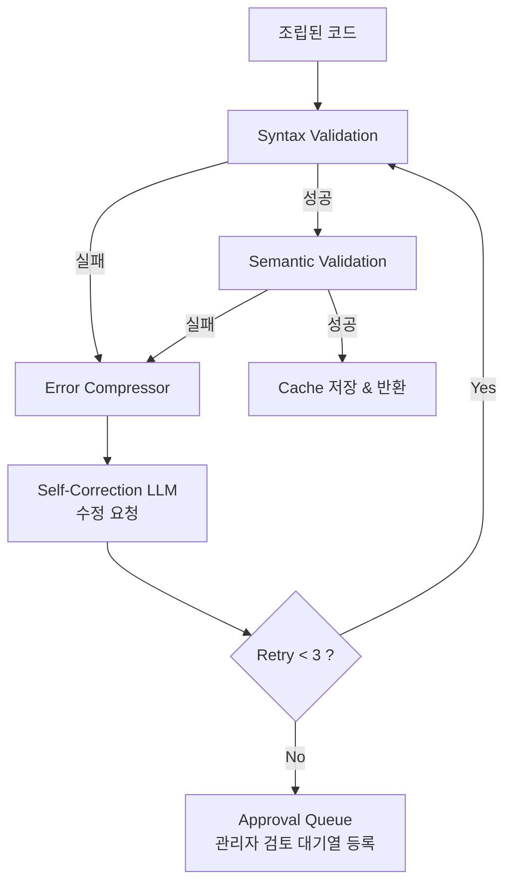

# Validator & Self-Correction Loop 설계

본 문서는 방안 C 아키텍처의 `Validator` 모듈과 에러 발생 시 동작하는 `Self-Correction Loop`(Error Context Compressor 포함)의 상세 설계를 다룹니다.

*   **컴포넌트**: `src/core/validator.py`
*   **관련 문서**: [architecture.md](architecture.md) | [execution_sequence.md](execution_sequence.md) §4 | [prompt_engineering_guide.md](prompt_engineering_guide.md) §2-3

---

## 1. Validator의 역할과 2단계 검증

Assembler가 조립한 최종 문자열 코드는 Pattern Cache에 저장되거나 즉시 실행되기 전에 반드시 100% 실행 가능한 상태인지 검증받아야 합니다.

Validator는 LLM의 환각(Hallucination)이나 파싱 오류로 인한 치명적인 런타임 에러를 사전에 차단하기 위해 **2단계 검증**을 수행합니다.

### 1단계: Syntax Validation (문법 검증)

파이썬 내장 `ast` 모듈을 사용하여 코드가 문법적으로 올바른지 확인합니다. 들여쓰기 오류, 괄호 닫힘 누락, 예약어 잘못 사용 등을 빠르고 저비용(로컬 연산)으로 잡아냅니다.

```python
import ast

def validate_syntax(code_string: str) -> tuple[bool, str | None]:
    """
    ast.parse()를 이용한 문법 검증.
    반환값: (성공 여부, 에러 메시지)
    """
    try:
        ast.parse(code_string)
        return True, None
    except SyntaxError as e:
        error_msg = f"SyntaxError at line {e.lineno}, offset {e.offset}: {e.msg}\n"
        error_msg += f"Code: {e.text}"
        return False, error_msg
```

### 2단계: Semantic Validation (의미 검증 / 시그널 존재 여부)

코드가 문법적으로는 맞다 해도 (`simva.set_signal(signals.BCM.WrongSignal, 'ON')`), 런타임에 해당 시그널이 실제 DB나 하드웨어에 존재하지 않으면 실패합니다. 

`Validator`는 `ast` 트리를 순회하며 `signals.ECU.SignalName` 패턴을 추출한 뒤, 해당 시그널이 **Ontology DB에 실제로 존재하는지 크로스체크**합니다.

```python
import ast

def validate_signals_exist(code_string: str, ontology_graph) -> tuple[bool, str | None]:
    """코드 내에 사용된 모든 시그널명 검증"""
    try:
        tree = ast.parse(code_string)
        for node in ast.walk(tree):
            if isinstance(node, ast.Attribute) and isinstance(node.value, ast.Attribute):
                if getattr(node.value.value, 'id', '') == 'signals':
                    ecu_name = node.value.attr
                    signal_name = node.attr
                    
                    # Ontology DB에서 검증
                    if not ontology_graph.validate_signal(ecu_name, signal_name):
                        return False, f"NameError: Signal '{ecu_name}.{signal_name}' not found in DB."
    except Exception:
        pass # 파싱 에러는 1단계에서 걸러짐
    
    return True, None
```

---

## 2. Error Context Compressor (에러 압축기)

방안 B에서는 에러 수정 시 수백 줄의 전체 코드와 긴 Traceback을 모두 LLM에 던졌습니다. 에러 원인은 한 줄인데 불필요한 토큰 소비가 컸습니다.

방안 C의 `Error Context Compressor`는 **에러가 발생한 위치의 앞뒤 ±3줄**만 잘라내어 컨텍스트를 극도로 압축합니다.

```python
def compress_error_context(code_string: str, error_line_num: int) -> str:
    """에러 발생 라인 기준 위아래 3줄만 추출하여 컨텍스트 압축"""
    lines = code_string.split('\n')
    start = max(0, error_line_num - 1 - 3)
    end = min(len(lines), error_line_num + 3)
    
    compressed_lines = []
    for i in range(start, end):
        line_num = i + 1
        prefix = ">>>>> " if line_num == error_line_num else "      "
        compressed_lines.append(f"{prefix}L{line_num}: {lines[i]}")
        
    return "\n".join(compressed_lines)

# 출력 예시:
#       L10: result = simva.is_eq(signals.BCM.Wiper_Staus, "ON")
# >>>>> L11: simva.set_signal(signals.BCM.Wiper_Staus, "HIGH")
#       L12: simva.wait(3.0)
```

> **비용 절감 효과**: `컴프레서 적용 전 (~1,500 tok) -> 적용 후 (~150 tok)` (토큰 90% 소모 감소)

---

## 3. Self-Correction Loop (자가 복구 루프)

Validator가 1단계나 2단계에서 에러를 뱉으면, `Self-Correction Loop`가 가동됩니다. 압축된 에러 컨텍스트를 [Self-Correction LLM 프롬프트](prompt_engineering_guide.md#2-3-self-correction-코드-교정기--error-compressor-통과-후-호출)에 주입하여 수정을 요청합니다.

**제한 루프 로직 (최대 3회)**:
무한 루프(비용 폭탄)를 막기 위해 에러 수정 시도는 최대 3회로 제한됩니다.



### 실패 시 Approval Queue 등록

3회 시도 후에도 해결되지 않으면(일반적으로 완전히 잘못된 템플릿 매칭이거나, DB에 아예 정보가 없는 경우), 변환 실패 처리 후 **관리자 검토 대기열(Approval Queue)**에 로깅됩니다. 테스트 엔지니어는 관리 UI에서 실패한 부분만 수동으로 교정하게 됩니다.

---

## 4. Pattern Cache와의 연결

이 모든 과정을 **단 1번이라도 무사히 통과한 코드**는 즉시 `Pattern Cache`에 저장됩니다.

다음 번에 동일한 TC 스텝("좌측 헤드램프를 켜라")이 들어오면, 복잡한 검증(1단계, 2단계)을 모두 생략하고 캐시에서 100% 무결성이 보장된 코드를 그대로 꺼내 씁니다. (`pattern_cache_design.md` 참고)
